# DynamicGraph — Mô hình mạng lưới tài chính động cho VN30

Hệ thống dựng đồ thị phụ thuộc động giữa 30 mã VN30, đo cấu trúc mạng lưới theo
thời gian, rồi **kiểm chứng ngoài mẫu** xem cấu trúc đó có giá trị dự báo hay giá
trị phân bổ vốn hay không.

Điểm khác biệt của kho mã này nằm ở chỗ nó **báo cáo cả kết quả phủ định**. Tầng
mô tả hoạt động tốt; tầng dự báo thất bại hoàn toàn; tầng phân bổ vốn thành công
một phần và phần thành công lại **không thuộc về đồ thị**. Cả ba đều được giữ
nguyên thay vì chỉ giữ phần có lợi.

```
Dữ liệu 2012-02-06 → 2026-07-24 · 30 mã + VN30 · 90.023 dòng giá
3.526 ảnh chụp đồ thị hằng ngày · 21 nếp gấp walk-forward · 1.323 ngày ngoài mẫu
239 test đơn vị
```

*(README này viết bằng tiếng Việt theo yêu cầu. Bản tiếng Anh có thể tạo lại nếu cần.)*

---

## Ba luận điểm và phán quyết

| # | Luận điểm | Phán quyết | Bằng chứng |
|---|---|---|---|
| 1 | Đồ thị **mô tả** được mã nào biến động cùng mã nào | ✅ **Được ủng hộ** | 3.526 ảnh chụp, tỷ lệ cạnh tồn tại giữa hai ngày ≈ 0,90 |
| 2 | Đồ thị **dự báo** được căng thẳng thị trường | ❌ **Bị bác bỏ** | **0/48** cấu hình đạt điểm kỹ năng Brier dương |
| 3 | Hiệp phương sai từ đồ thị **cải thiện phân bổ vốn** | ◐ **Một phần** | Mô hình hoá phụ thuộc thắng; graphical lasso **không** thắng hiệp phương sai mẫu |

Ba luận điểm được kiểm chứng tách rời **có chủ ý**. Gộp chúng lại là cách dễ nhất
để thổi phồng giá trị của một mô hình mạng lưới: "phương sai tối thiểu thắng chia
đều" hoàn toàn **không** đồng nghĩa với "đồ thị có ích".

### Kết quả phân bổ vốn (ngoài mẫu, đã trừ phí 15 điểm cơ bản mỗi chiều)

| Danh mục | Biến động | Lợi suất | Sharpe | Sụt giảm sâu nhất | Vòng quay |
|---|---:|---:|---:|---:|---:|
| phương sai tối thiểu · ledoit-wolf | **16,44%** | 14,41% | **0,876** | −41,3% | 0,515 |
| phương sai tối thiểu · glasso | 16,46% | 14,20% | 0,863 | −42,2% | 0,541 |
| phương sai tối thiểu · sample | 16,50% | 14,45% | 0,876 | −41,7% | 0,555 |
| risk parity · sample | 18,53% | 16,19% | 0,874 | −41,5% | 0,199 |
| **risk parity theo cụm** | **19,53%** | 15,54% | 0,796 | −48,0% | 0,464 |
| chia đều *(mốc so sánh)* | 20,34% | 16,12% | 0,792 | −42,6% | 0,065 |

### Phép thử cô lập — chỉ thay bộ ước lượng, giữ nguyên mọi thứ khác

| Quy tắc | Bộ ước lượng | Chênh lệch biến động | KTC 95% | p | Kết luận |
|---|---|---:|---|---:|---|
| phương sai tối thiểu | ledoit-wolf | −0,052 đ% | [−0,121, +0,013] | 0,066 | không khác biệt |
| phương sai tối thiểu | **glasso** | **−0,039 đ%** | **[−0,082, +0,005]** | 0,042 | **không khác biệt** |
| risk parity | glasso | +0,006 đ% | [+0,001, +0,012] | 0,982 | tệ hơn |

**0/6** phép so sánh cho thấy graphical lasso giảm rủi ro có ý nghĩa. Khoảng tin
cậy cắt qua số 0 ở cả hai lần chênh lệch âm.

---

## Chạy thử

```bash
pip install -r requirements.txt
cp config/local.example.yaml config/local.yaml   # trỏ tới cơ sở dữ liệu của bạn

python -m dynamicgraph.cli discover-data          # dò tìm nguồn dữ liệu
python scripts/run_full_pipeline.py --config config/local.yaml
python scripts/run_allocation.py  --config config/local.yaml
python scripts/build_dashboard.py --open          # bảng điều khiển ngoại tuyến
pytest -q
```

Bảng điều khiển là **một tệp HTML tự chứa** — nhấp đúp là chạy, không cần máy chủ,
không cần mạng. Chi tiết trong [`dashboard/README.md`](dashboard/README.md).

---

# Nhận xét chi tiết các biểu đồ

36 biểu đồ trong [`artifacts/figures/`](artifacts/figures/). Phần dưới đây đọc
từng biểu đồ: nó cho thấy gì, nên rút ra điều gì, và **ở đâu nó gây hiểu nhầm**.

## A. Cấu trúc mạng lưới

### 01 · Mạng tương quan riêng phần, ảnh chụp gần nhất

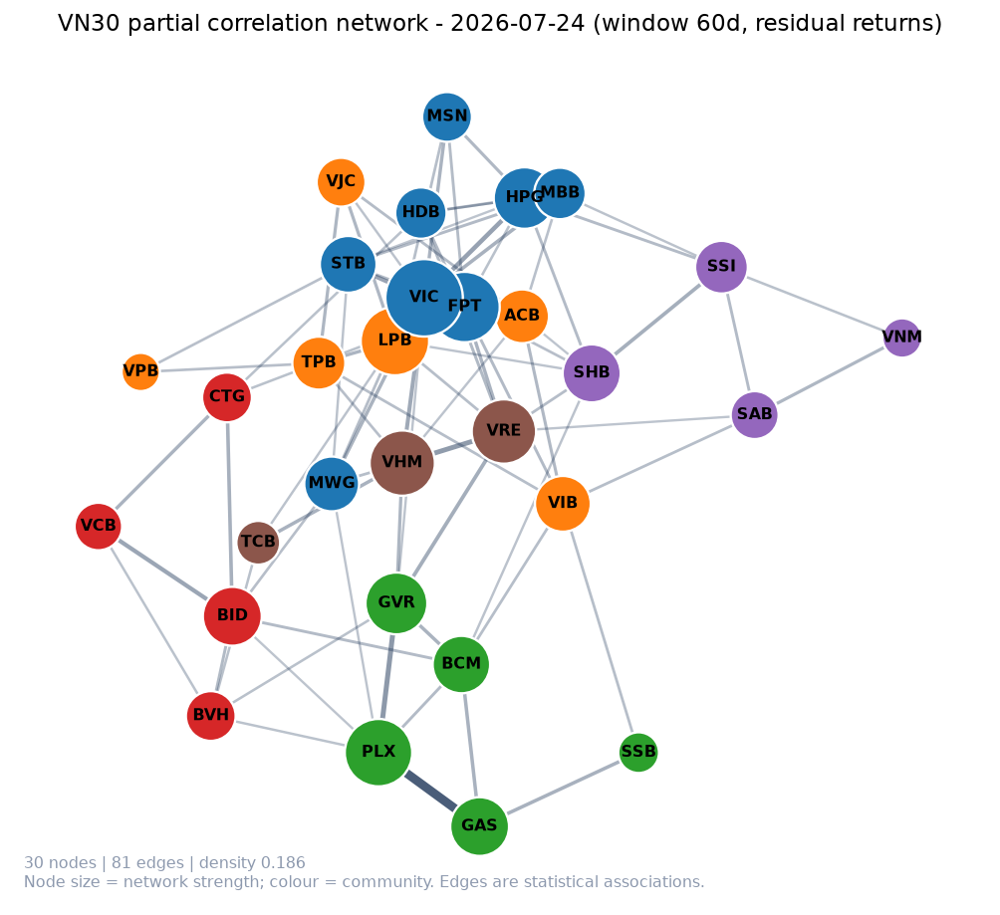

30 đỉnh, 81 cạnh, mật độ 0,186. Kích thước đỉnh là độ mạnh mạng lưới, màu là cụm.

**Đọc gì:** VIC là đỉnh lớn nhất, nằm giữa cùng FPT — hai mã có tổng liên hệ có
điều kiện mạnh nhất. Cụm xanh lá dưới đáy (GAS–PLX–BCM–GVR–SSB) tách khá rõ khỏi
phần còn lại: nhóm năng lượng và bất động sản khu công nghiệp. Cạnh GAS–PLX là
cạnh đậm nhất trong toàn đồ thị.

**Cẩn thận:** đây là tương quan **riêng phần** trên lợi suất đã khử ảnh hưởng
VN30. Một cạnh nghĩa là "hai mã còn liên hệ với nhau sau khi đã trừ ảnh hưởng thị
trường **và** ảnh hưởng của 28 mã kia". Nó không nói gì về nhân quả, và không
phải tương quan thông thường — hãy so với biểu đồ 16 để thấy khác biệt.

### 02 · Cấu trúc mạng qua thời gian

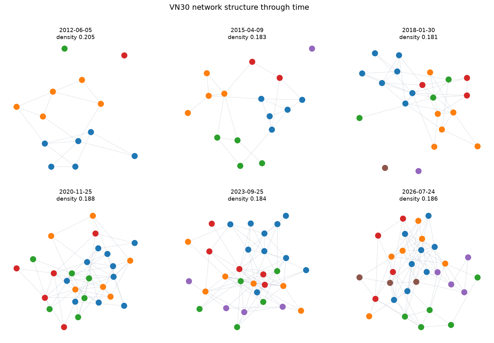

Sáu lát cắt từ 2012 đến 2026, mật độ dao động rất hẹp: 0,181–0,205.

**Đọc gì:** mật độ gần như không đổi suốt 14 năm, nhưng **số đỉnh tăng gấp đôi** —
từ khoảng 15 mã năm 2012 lên 30 mã từ 2018. Đây là điều quan trọng nhất trong
biểu đồ này, và nó giải thích một hiện tượng ở biểu đồ 10.

**Cẩn thận:** mật độ ổn định ở đây **không phải phát hiện về thị trường**. Bộ lọc
cạnh dùng phân vị (giữ 25% cạnh mạnh nhất) nên nó tự chuẩn hoá mật độ theo thiết
kế. Mật độ ổn định là hệ quả của bộ lọc, không phải của dữ liệu.

### 17 · Mạng trên lợi suất thô

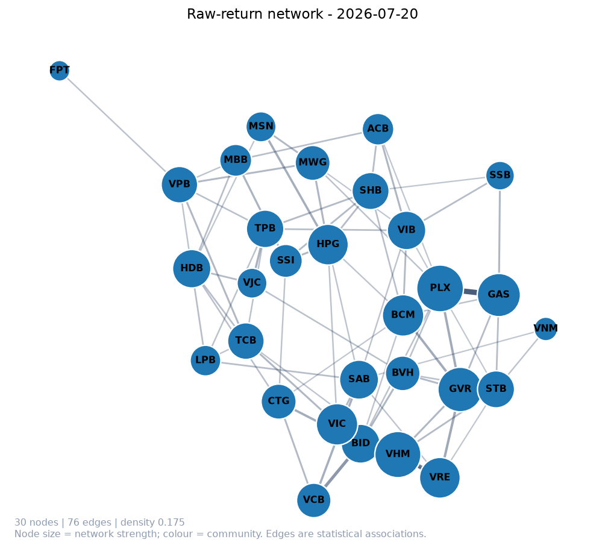

Cùng ngày, cùng phương pháp, nhưng **không** khử ảnh hưởng thị trường: 76 cạnh,
mật độ 0,175.

**Đọc gì:** so với biểu đồ 01, việc khử thị trường thay đổi cấu trúc thật sự —
FPT ở đây bị đẩy ra rìa với đúng một cạnh, trong khi ở mạng phần dư nó là đỉnh
trung tâm thứ hai. Đây là lý do phần dư được chọn làm tầng lõi: nếu không khử,
phần lớn "liên hệ" chỉ là cả thị trường cùng lên xuống.

### 16 · Tương quan so với tương quan riêng phần

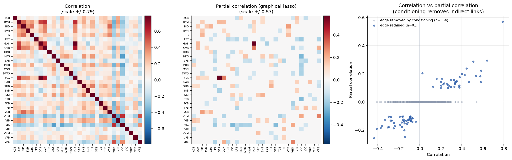

Đây là biểu đồ giải thích rõ nhất vì sao dùng graphical lasso.

**Đọc gì:** bảng trái (tương quan thường) gần như đỏ toàn bộ — mọi cặp đều tương
quan dương. Bảng giữa (riêng phần) gần như trắng. Bảng phải cho con số:
**354 cạnh bị loại bỏ khi điều kiện hoá**, chỉ 81 cạnh sống sót. Nói cách khác,
**81% các "mối liên hệ" trong ma trận tương quan là gián tiếp** — A liên hệ với B
chỉ vì cả hai cùng liên hệ với C.

Điểm đáng chú ý: khối VHM–VIB–VIC–VRE ở góc dưới phải có tương quan **âm** mạnh
với phần còn lại trong bảng trái. Đó là hệ quả của việc khử thị trường — khi nhóm
Vingroup mạnh hơn thị trường thì phần còn lại yếu hơn theo định nghĩa.

### 13 · Bản đồ nhiệt centrality theo thời gian

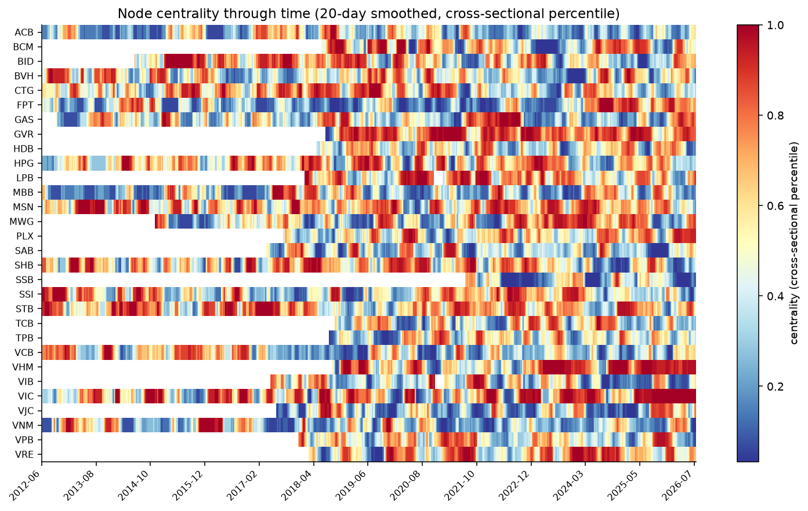

**Đọc gì:** vùng trắng bên trái là các mã **chưa có dữ liệu** — BCM, GVR, HDB,
LPB, PLX, SAB, SSB, TCB, TPB, VHM, VRE đều gia nhập từ 2017–2019. Điều này quan
trọng: **nửa rổ VN30 hiện tại không tồn tại trong nửa đầu giai đoạn nghiên cứu.**

Màu nhấp nháy dữ dội theo chiều ngang: thứ hạng centrality của một mã thay đổi
gần như hằng ngày. Không mã nào giữ vị trí trung tâm ổn định. VIC là ngoại lệ duy
nhất — đỏ liên tục từ 2024 trở đi.

### 14 · Tám mã trung tâm nhất theo thời gian

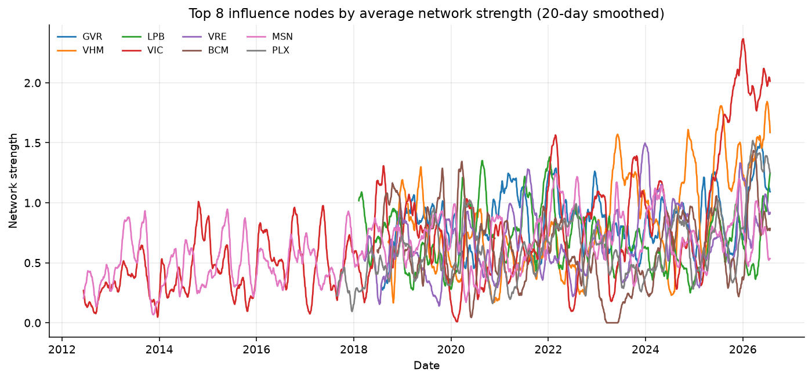

**Đọc gì:** trước 2018 chỉ có VIC và MSN có dữ liệu. Từ 2024 VIC tách hẳn lên trên
(độ mạnh 2,0–2,3 so với 0,5–1,5 của phần còn lại). Cùng lúc VHM cũng tăng.

**Cẩn thận:** trục tung là độ mạnh mạng lưới — tổng trị tuyệt đối các cạnh. Nó
tăng khi mã đó liên hệ mạnh hơn với phần còn lại, **không phải khi giá tăng**.
Đừng đọc biểu đồ này như một chỉ báo giá.

### 29 · Bản đồ rủi ro theo mã

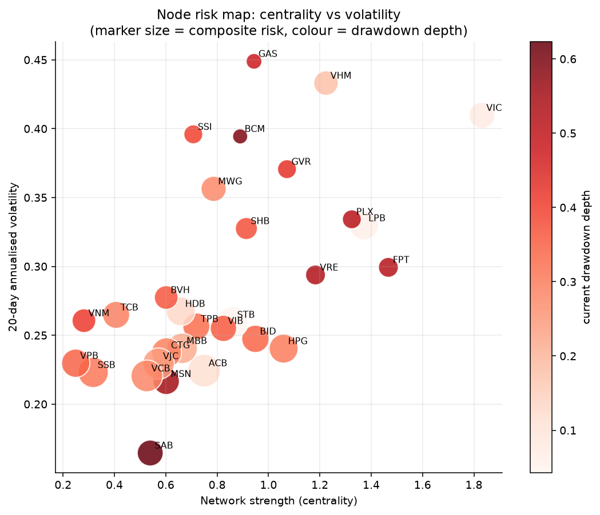

Trục hoành: độ mạnh mạng lưới. Trục tung: biến động 20 ngày. Màu: độ sâu sụt giảm.

**Đọc gì:** **không có tương quan rõ ràng giữa centrality và biến động.** VIC ở xa
nhất bên phải (mạng mạnh nhất) nhưng biến động chỉ ở mức trung bình cao. SAB ở góc
dưới trái — biến động thấp nhất, mạng yếu — nhưng lại có sụt giảm sâu nhất (màu
đậm nhất, ~62%). GAS có biến động cao nhất nhưng mạng yếu.

Đây là bằng chứng trực quan cho kết luận ở tầng xếp hạng: **vị trí trong mạng lưới
không phải thước đo rủi ro**.

## B. Cụm và sự ổn định

### 11 · Số lượng cụm

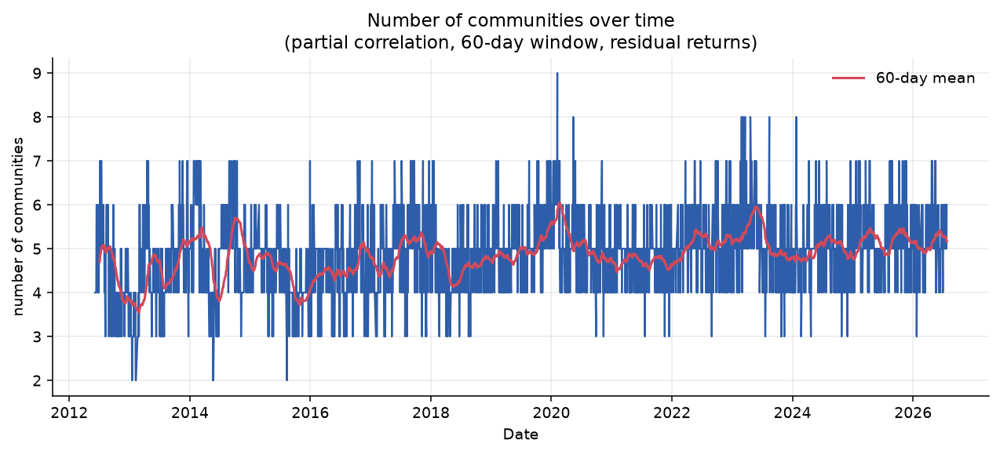

Dao động 2–9, trung bình trượt quanh 4,5–5,5. Đỉnh 9 cụm vào đầu 2020.

### 12 · Di trú cụm — **biểu đồ này bị hỏng**

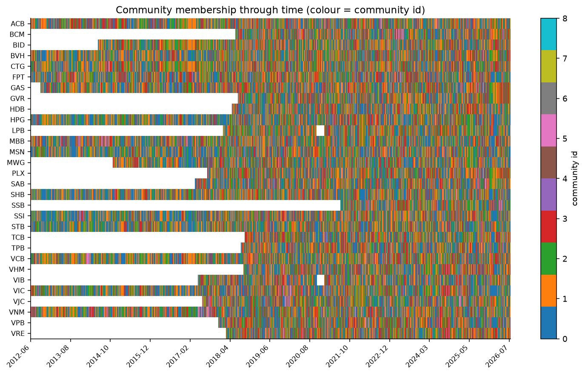

Biểu đồ nhấp nháy hỗn loạn, trông như thành viên cụm đổi mỗi ngày.

**Đây gần như hoàn toàn là hiện vật kỹ thuật, không phải hiện tượng thị trường.**
Thuật toán phát hiện cụm gán **nhãn số tuỳ ý** ở mỗi ảnh chụp — cụm "0" hôm nay và
cụm "0" ngày mai không có liên quan gì. Chưa có bước ghép nhãn giữa các ngày, nên
biểu đồ đang hiển thị hiện tượng *hoán vị nhãn* chứ không phải sự bất ổn thật của
phân hoạch.

Đây là lỗi trong khâu trình bày, **đã ghi nhận và chưa sửa**. Cách sửa đúng là
ghép nhãn giữa hai ngày liên tiếp bằng thuật toán Hungarian trên độ trùng lặp
thành viên trước khi vẽ.

Lỗi này **không** ảnh hưởng tới quy tắc risk parity theo cụm, vì quy tắc đó chỉ
dùng phân hoạch tại một thời điểm (nhóm nào chứa mã nào), không dùng danh tính
nhãn xuyên thời gian.

### 15 · Vòng quay cạnh · 28 · Độ ổn định cạnh

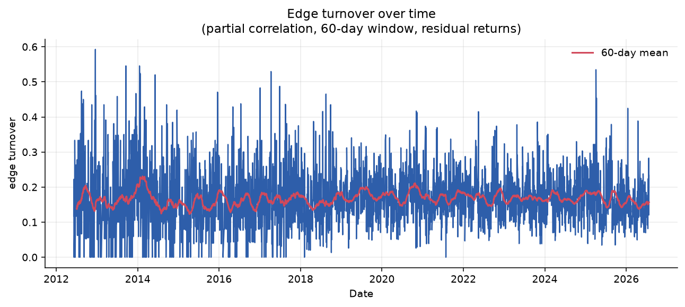
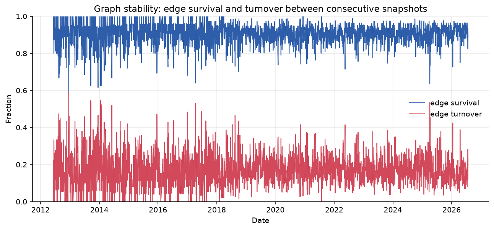

**Đọc gì:** tỷ lệ cạnh tồn tại giữa hai ngày liên tiếp giữ ổn định quanh **0,90**
suốt 14 năm; vòng quay quanh 0,15–0,20. Đây là bằng chứng chính cho luận điểm 1:
đồ thị đủ ổn định để có ý nghĩa. Nếu cạnh đổi 50% mỗi ngày thì mọi thứ xây trên nó
đều vô nghĩa.

Giai đoạn 2012–2014 nhiễu hơn hẳn (biên độ rộng hơn) — đó là khi rổ chỉ có ~15 mã.

### 30 · Sankey ngành ↔ cụm

[`30_sector_community_sankey.html`](artifacts/figures/30_sector_community_sankey.html) — biểu đồ tương tác.

Cụm phát hiện được **không** trùng với phân ngành ICB. Độ thuần ngành tổng thể chỉ
0,533; cụm C0 chỉ đạt 0,375. Điều này có ý nghĩa: cấu trúc đồng biến động của thị
trường Việt Nam **không** chạy theo ranh giới ngành.

## C. Chỉ số mạng lưới theo thời gian

### 07 · Mật độ đồ thị

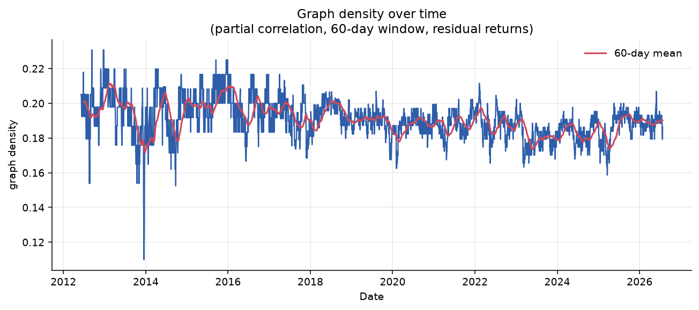

Dao động 0,17–0,22 suốt 14 năm. **Gần như không có thông tin** — vì bộ lọc phân vị
cố định mật độ theo thiết kế (xem lại nhận xét biểu đồ 02). Biểu đồ này chủ yếu có
giá trị chẩn đoán: nó xác nhận bộ lọc hoạt động đúng.

### 08 · Bán kính phổ

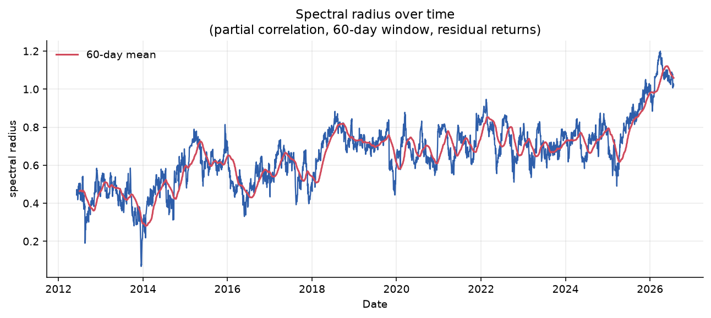

**Đọc gì:** xu hướng tăng rõ ràng từ ~0,45 (2012) lên ~1,05 (2026). Bán kính phổ
đo mức độ tập trung của cấu trúc liên hệ vào một hướng chính.

**Cẩn thận:** xu hướng này **trùng với việc rổ mở rộng từ 15 lên 30 mã**. Bán kính
phổ của ma trận kề tăng theo số đỉnh khi mật độ giữ nguyên. Phần nào của xu hướng
là thị trường và phần nào là số đỉnh — biểu đồ này không tách được, và điều đó
chưa được kiểm soát trong quy trình.

### 09 · Tỷ trọng mode thị trường

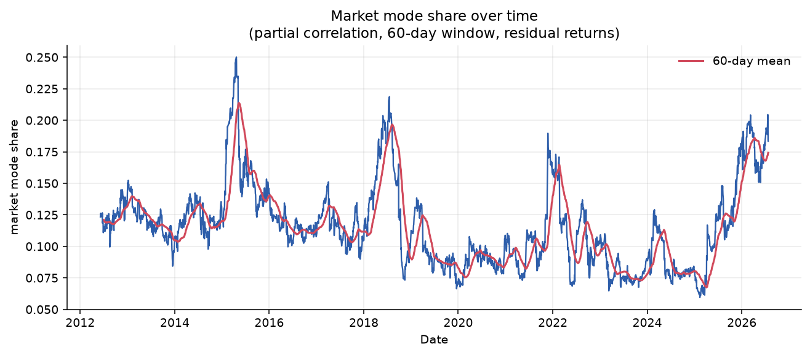

**Đọc gì:** đây là chỉ số giàu thông tin nhất trong nhóm. Các đỉnh nhọn rõ ràng
vào **2015-04** (0,25), **2018-06** (0,22), **2022-01** (0,19) và **2026** (0,20).
Ba mốc đầu tương ứng với ba giai đoạn thị trường Việt Nam thực sự căng thẳng.

Tỷ trọng mode thị trường tăng nghĩa là ngày càng nhiều phương sai chung dồn vào
một nhân tố duy nhất — tức là **đa dạng hoá đang tan rã**. Đây là chỉ số hợp lý
nhất để dùng cho việc điều chỉnh tổng trạng thái, và nó cũng là đặc trưng quan
trọng nhất trong biểu đồ 23.

Lưu ý: 2020 **không** có đỉnh, dù đó là cú sụp sâu nhất giai đoạn.

### 10 · Tập trung centrality (Herfindahl) — **cần đọc thận trọng**

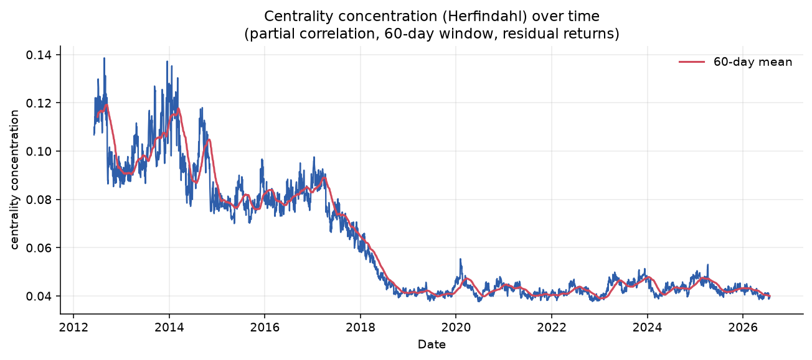

Biểu đồ cho thấy một bước nhảy mạnh: từ ~0,12 trước 2018 xuống ~0,04 sau đó, rồi
đi ngang.

**Đây gần như chắc chắn là hiện vật của việc rổ mở rộng, không phải hiện tượng thị
trường.** Chỉ số Herfindahl có sàn bằng 1/N: với 15 mã sàn là 0,067, với 30 mã sàn
là 0,033. Bước nhảy xảy ra **đúng lúc** số mã tăng gấp đôi (đối chiếu biểu đồ 13),
và giá trị sau bước nhảy nằm ngay sát sàn lý thuyết mới.

Điều này quan trọng vì **chỉ số này là một thành phần của "stress score"** ở biểu
đồ 03. Một phần hành vi của stress score đang bị chi phối bởi số lượng mã trong
rổ. Chưa sửa; cách sửa đúng là chuẩn hoá Herfindahl theo N.

## D. Chỉ số tập trung cấu trúc ("stress score")

### 03 · Lịch sử chỉ số

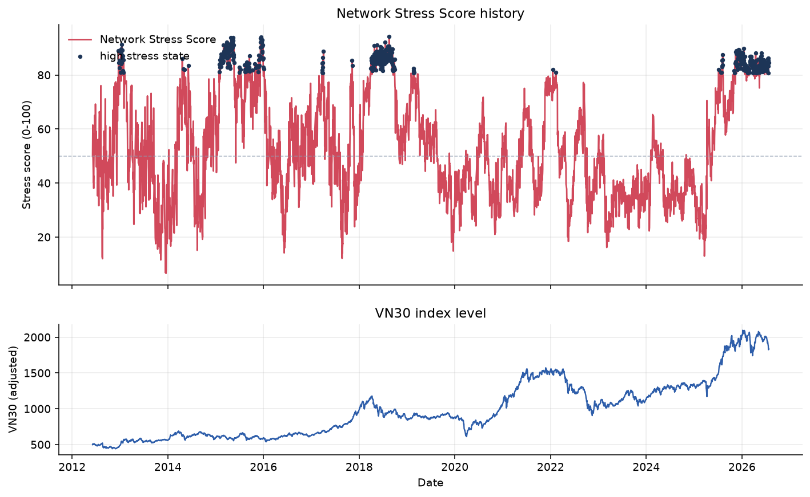

### 06 · Chỉ số so với sụt giảm VN30 — **biểu đồ quan trọng nhất trong kho này**

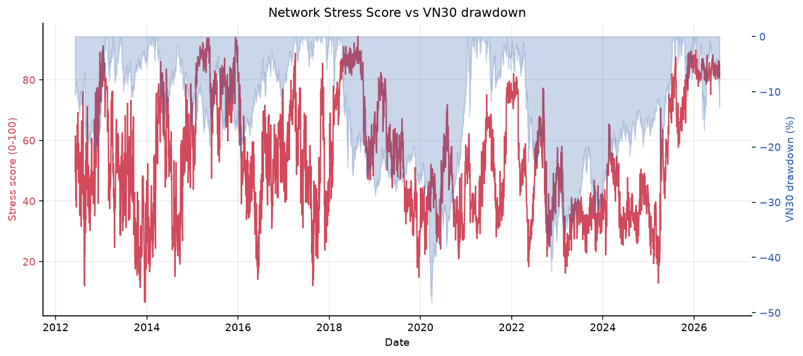

**Đọc gì — và đây là điều cần đọc kỹ:**

| Thời điểm | Sụt giảm VN30 | Chỉ số |
|---|---:|---:|
| 03/2020 (COVID) | **−45%** | ~30–40 (thấp) |
| 2018 | ~0% (vùng đỉnh) | **85+ (rất cao)** |
| 2026 hiện tại | ~−5% | **85 (rất cao)** |

**Chỉ số này cao nhất khi thị trường ở đỉnh, và thấp trong cú sụp lớn nhất của
giai đoạn.** Cái tên "stress score" trong mã nguồn là **sai lệch nghiêm trọng**.

Nó không đo tình trạng thị trường. Nó đo **mức độ tập trung của cấu trúc phụ
thuộc** — và cấu trúc có thể tập trung cao trong lúc giá đang tăng đều. Trong bảng
điều khiển tôi đã đổi nhãn thành **"Chỉ số tập trung cấu trúc"**; tên trong mã
nguồn chưa đổi vì việc đó chạm vào lược đồ đầu ra và cần một lần chạy lại đầy đủ.

Hiện tại chỉ số ở mức 84,6 — phân vị lịch sử 92,8%. Điều đó nghĩa là **cấu trúc
mạng lưới đang tập trung bất thường**, không nghĩa là thị trường sắp sụp.

### 27 · Phát hiện giai đoạn căng thẳng — **con số gây hiểu nhầm**

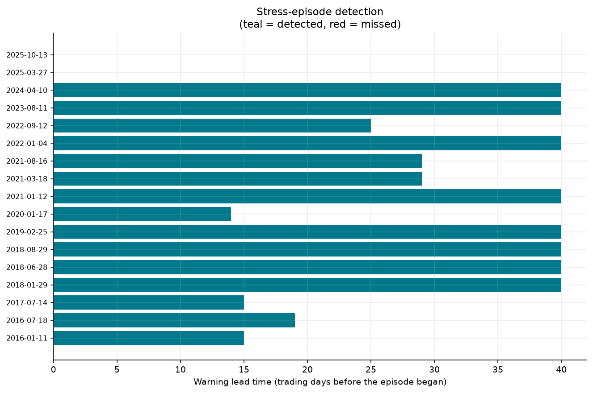

Biểu đồ cho thấy 15/17 giai đoạn được "phát hiện", phần lớn với thời gian cảnh báo
**đúng 40 ngày**.

**Con số 40 đó là trần của cửa sổ tìm kiếm, không phải thời gian cảnh báo thật.**
Khi 8 trong 15 thanh đều chạm đúng mức tối đa, điều đó nói rằng cửa sổ đã bão hoà —
chỉ số ở mức cao suốt 40 ngày trước sự kiện, và có thể còn cao lâu hơn nữa. Với
một chỉ số nằm trên ngưỡng phần lớn thời gian, "phát hiện được" là chuyện gần như
hiển nhiên.

Hai giai đoạn gần nhất (2025-03, 2025-10) bị **bỏ sót hoàn toàn**.

Đây là lý do biểu đồ này không được dùng làm bằng chứng cho bất kỳ luận điểm nào.
Bằng chứng nằm ở tầng ngoài mẫu, mục E.

## E. Tầng dự báo — nơi mô hình thất bại

### 24 · So sánh Brier giữa các mô hình

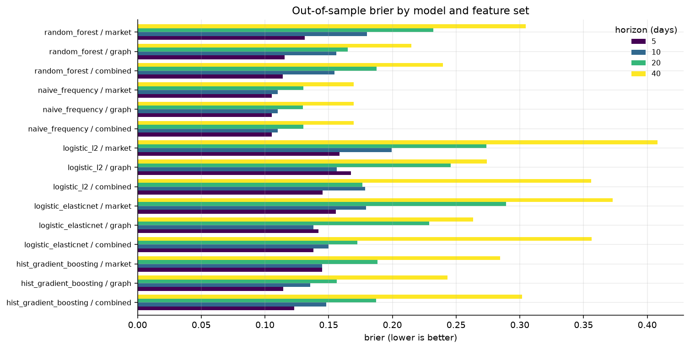

**Đọc gì:** ba thanh của `naive_frequency` (market / graph / combined) **ngắn nhất
ở mọi tầm dự báo**. Thanh dài nhất thuộc về `logistic_l2` và `logistic_elasticnet`
ở tầm 40 ngày (Brier 0,37–0,41 so với 0,17 của naive).

Mô hình học máy càng linh hoạt càng thua nặng. Random forest và gradient boosting
nằm giữa. Không mô hình nào thắng phép đếm.

### 25 · Hiệu năng theo từng nếp gấp

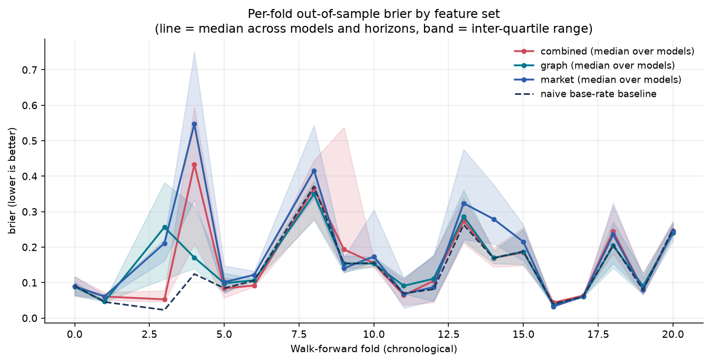

**Đọc gì:** đường nét đứt (mốc naive) **nằm dưới hoặc ngang bằng** cả ba đường đặc
ở gần như mọi nếp gấp. Nếp gấp 4 là thảm hoạ: market đạt Brier 0,55 trong khi naive
chỉ 0,12.

Từ nếp gấp 9 trở đi, ba đường gần như trùng khít với mốc naive. Điều đó nghĩa là
các mô hình đã **hội tụ về việc dự báo tần suất nền** — chúng học được rằng không
có tín hiệu nào để học.

### 19 · Đường hiệu chuẩn

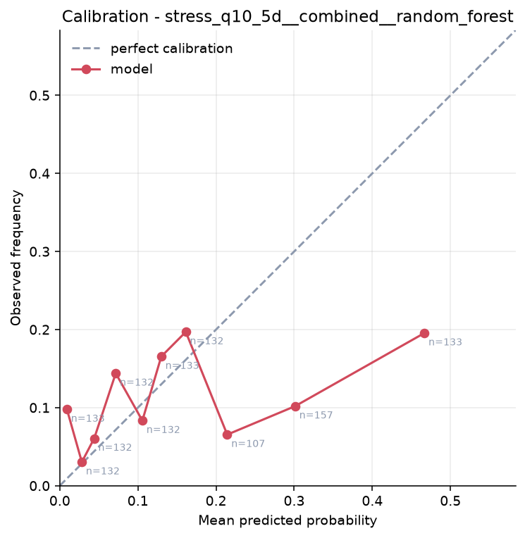

**Đọc gì:** đường mô hình nằm **dưới đường chéo lý tưởng ở mọi khoảng**, và nghiêm
trọng nhất ở đầu cao: khi mô hình nói "46% khả năng căng thẳng", tần suất thực tế
chỉ **19,5%**. Mô hình **thổi phồng rủi ro gấp 2,4 lần** ở vùng nó tự tin nhất.

Đường còn không đơn điệu — khoảng 0,21 cho tần suất thực 0,065, thấp hơn cả khoảng
0,07. Xác suất đầu ra **không xếp hạng đúng** mức rủi ro thật.

### 20 · Đường ROC và Precision–Recall

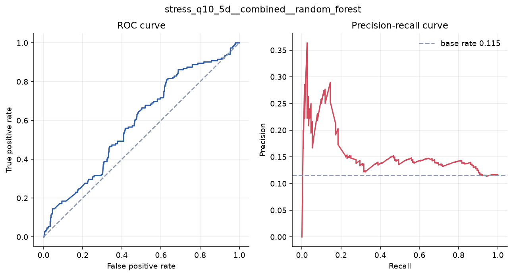

**Đọc gì:** ROC nằm trên đường chéo — có chút khả năng phân biệt (AUROC ≈ 0,59 ở
cấu hình tốt nhất). Nhưng đường PR mới là đường cần đọc với dữ liệu mất cân bằng:
nó dao động quanh 0,13–0,15 so với tần suất nền 0,115.

Nói cụ thể: **cải thiện độ chính xác khoảng 2 điểm phần trăm trên nền 11,5%**.
Không đủ để hành động.

### 22 · Ma trận nhầm lẫn

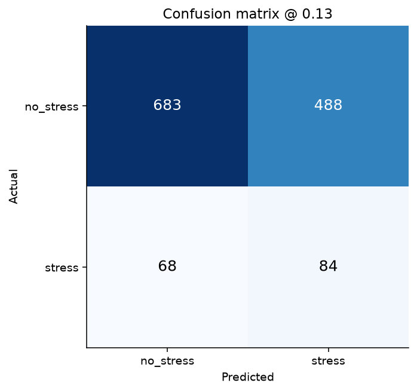

Tại ngưỡng 0,13: **488 cảnh báo giả** so với 84 lần phát hiện đúng. Tỷ lệ chính xác
84/572 = **14,7%**. Và vẫn bỏ sót 68 trên 152 sự kiện thật.

Nói bằng ngôn ngữ vận hành: gần **6 cảnh báo sai cho mỗi lần đúng**, trong khi vẫn
bỏ lỡ 45% số sự kiện.

### 26 · Dòng thời gian xác suất ngoài mẫu

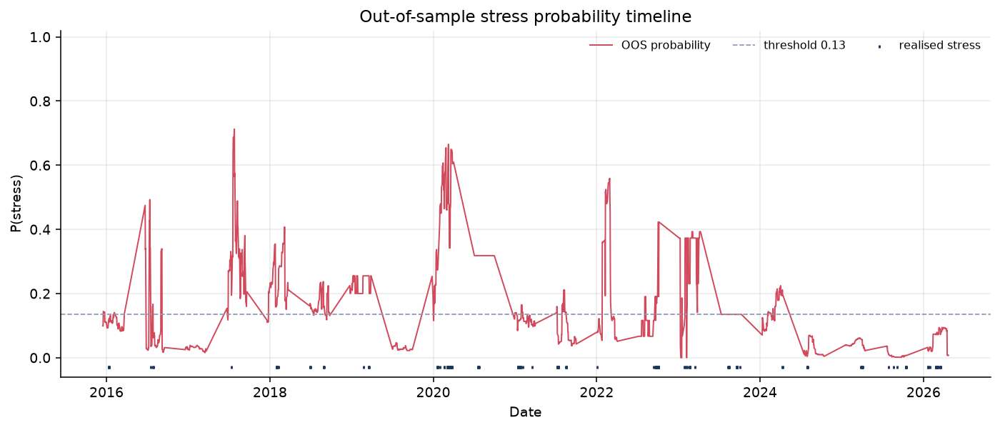

**Đọc gì:** xác suất tăng vọt lên 0,6–0,66 trong 2020 — trùng với cú sụp COVID.
Nhưng cũng tăng lên 0,71 giữa 2017 khi không có gì xảy ra, và lên 0,55 đầu 2022.

Các dấu chấm dưới đáy (sự kiện thật) rải đều, **không tập trung dưới các đỉnh xác
suất**. Đó chính là hình ảnh của AUROC ≈ 0,5.

Đoạn 2023 có những khối phẳng kéo dài — đó là các nếp gấp mà mô hình xuất ra hằng
số, tức là bộ chọn đặc trưng không tìm được đặc trưng nào dùng được.

### 23 · Tầm quan trọng đặc trưng

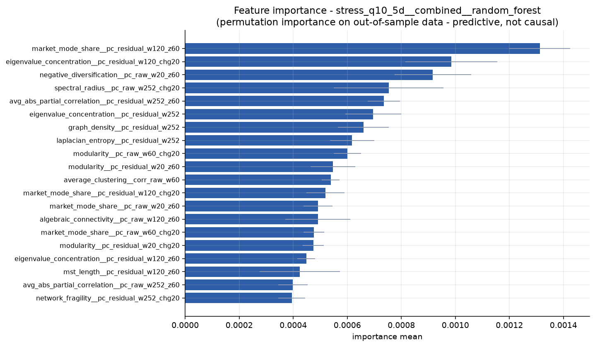

**Đọc gì:** `market_mode_share__pc_residual_w120_z60` đứng đầu, cách biệt rõ so với
phần còn lại. Điều này nhất quán với biểu đồ 09 — tỷ trọng mode thị trường là chỉ
số mạng lưới giàu thông tin nhất.

**Cẩn thận nghiêm túc:** thang đo là **0,0000–0,0014**. Đây là tầm quan trọng hoán
vị trên một mô hình có điểm kỹ năng **âm**. Xếp hạng đặc trưng của một mô hình thua
mốc naive là xếp hạng những đặc trưng góp phần vào việc *thua*. Biểu đồ này mô tả
mô hình, **không** mô tả thị trường.

### 24b · Nghiên cứu cắt bỏ

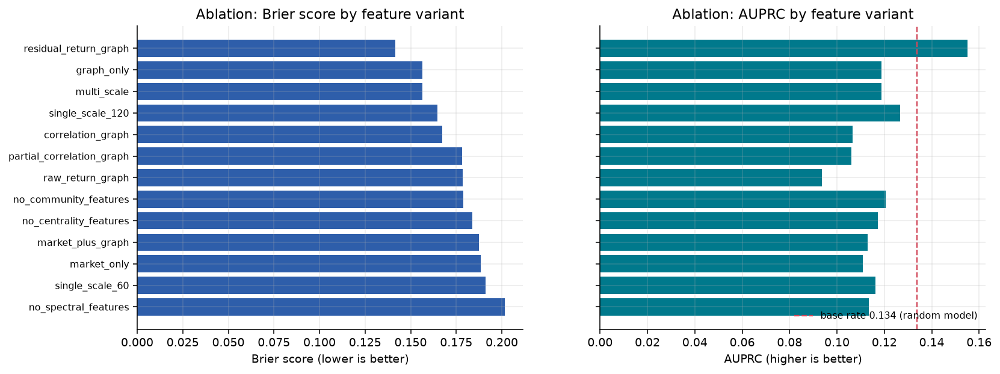

**Đọc gì:** `residual_return_graph` đứng đầu cả hai bảng, và là biến thể **duy
nhất** vượt tần suất nền 0,134 ở AUPRC. `no_spectral_features` xếp cuối — bỏ đặc
trưng phổ làm mô hình xấu đi nhiều nhất.

`market_only` (0,188) gần như ngang `market_plus_graph` (0,187): **thêm đồ thị vào
đặc trưng thị trường gần như không thay đổi gì.**

### Xếp hạng chéo giữa các mã

| Bộ đặc trưng | IC trung bình | t (Newey–West) | t (i.i.d. — **sai**) |
|---|---:|---:|---:|
| chỉ đặc trưng của mã | **0,103** | **4,93** | 15,36 |
| + centrality | 0,060 | 2,98 | 9,26 |
| + tổng hợp hàng xóm | 0,049 | 2,53 | 7,74 |

Đặc trưng riêng của từng mã **có** khả năng xếp hạng thật. Thêm thông tin mạng lưới
làm IC **giảm**. Kết luận: centrality mô tả vị trí cấu trúc, không mô tả lợi suất
kỳ vọng.

## F. Tầng phân bổ vốn — nơi có kết quả dương

### 31 · Rủi ro và lợi suất thực hiện

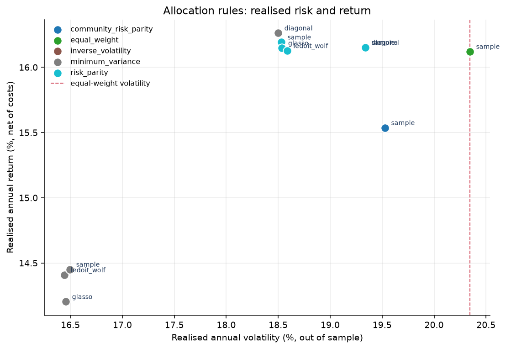

**Đọc gì:** ba chấm xám của phương sai tối thiểu nằm tách hẳn ở góc dưới trái —
biến động 16,4–16,5% so với 20,3% của chia đều (đường đứt bên phải). **Đây là kết
quả dương duy nhất của toàn dự án.**

Nhưng đọc trục tung: chúng cũng ở **thấp nhất về lợi suất** (14,2–14,5% so với
16,1%). Việc giảm rủi ro không miễn phí. Sharpe vẫn cải thiện (0,876 so với 0,792)
nhưng biên độ khiêm tốn.

Ba chấm xám **chồng lên nhau gần như hoàn toàn** — đó chính là kết quả phủ định về
graphical lasso, nhìn thấy được bằng mắt.

Chấm ở 19,53% là risk parity theo cụm: **tệ hơn** cả risk parity thường (18,53%).
Đầu vào duy nhất mà chỉ đồ thị cung cấp được lại làm kết quả xấu đi.

### 33 · Biến động thực hiện trượt

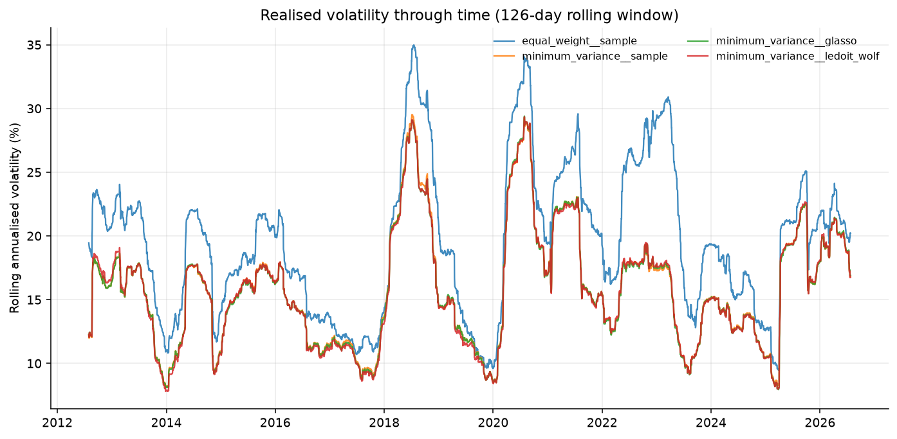

**Đây là biểu đồ thuyết phục nhất trong toàn bộ kho mã.**

**Đọc gì:** đường xanh dương (chia đều) nằm **trên** ba đường còn lại ở gần như mọi
thời điểm trong 14 năm. Khoảng cách rộng nhất đúng vào các giai đoạn căng thẳng:
2018 (35% so với 29,5%), 2020 (34% so với 29%), 2022–2023 (31% so với 22%).

Đồng thời: **ba đường phương sai tối thiểu không phân biệt được bằng mắt.** Cam
(sample), xanh lá (glasso), đỏ (ledoit-wolf) chồng khít nhau suốt 3.549 ngày.

Một biểu đồ, hai kết luận: **mô hình hoá phụ thuộc có tác dụng thật và nhất quán;
việc chọn bộ ước lượng nào thì không quan trọng.**

### 32 · Đường vốn tích luỹ

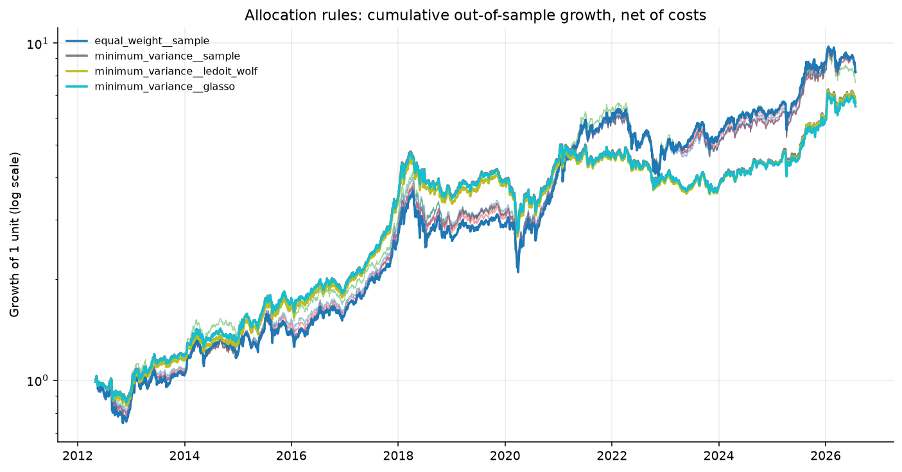

Thang log. Các đường bám nhau khá sát — chênh lệch lợi suất giữa các quy tắc nhỏ
hơn nhiều so với chênh lệch rủi ro. Đây là điều nên kỳ vọng: các quy tắc này chỉ
dùng ma trận hiệp phương sai, không dùng vector kỳ vọng.

### 34 · Số cược hiệu dụng — **cột này không so sánh được giữa các bộ ước lượng**

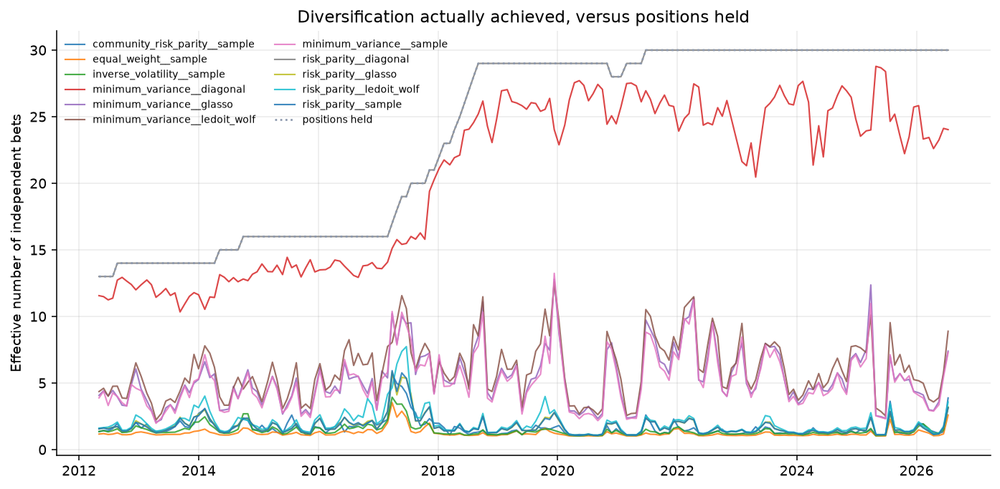

**Đây là một lỗi trong thiết kế đo lường của tôi, và tôi để nguyên nó cùng lời cảnh
báo thay vì âm thầm bỏ đi.**

Số cược hiệu dụng được tính **dưới ma trận hiệp phương sai của chính bộ ước lượng
đó**. Bộ `diagonal` giả định tương quan bằng 0, nên theo đúng giả định ấy nó báo
~20–24 cược độc lập, trong khi hiệp phương sai mẫu báo ~5. Con số cao đó phản ánh
**giả định**, không phản ánh đa dạng hoá thật.

Cột này **chỉ dùng để so giữa các quy tắc trọng số**. Cách sửa đúng là đo mọi danh
mục dưới một ma trận hiệp phương sai tham chiếu chung.

Điều **vẫn đọc được**: risk parity đạt ~1,76 cược hiệu dụng, chia đều đạt ~1,24 —
tức là **giữ 30 mã VN30 chỉ tương đương chưa tới 2 cược độc lập**. Đó là bản chất
của một chỉ số một quốc gia có một nhân tố chi phối.

## G. Độ bền vững — nơi có phát hiện khó chịu nhất

### 16b · Mức đồng thuận giữa các biến thể dựng đồ thị

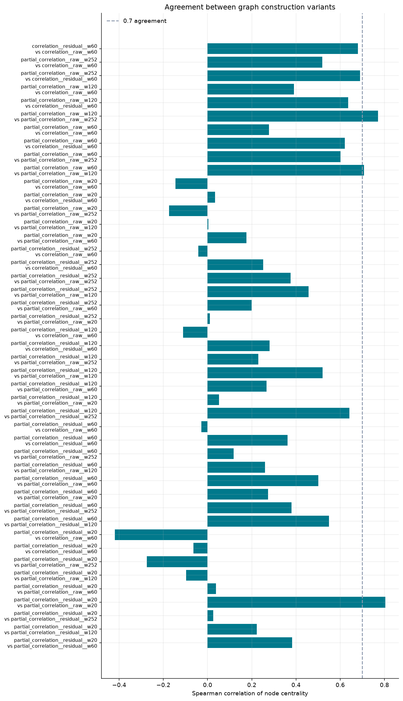

**Đây là biểu đồ đáng lo nhất trong kho này.**

**Đọc gì:** trong ~40 cặp biến thể, **chỉ 3 cặp** vượt ngưỡng đồng thuận Spearman
0,7 (đường đứt). Nhiều cặp gần bằng 0. Và vài cặp **âm rõ rệt**:

- `partial_correlation__residual__w20` so với `correlation__raw__w60`: **−0,42**
- `partial_correlation__raw__w20` so với `partial_correlation__raw__w252`: **−0,17**

Xếp hạng centrality **không phải một thuộc tính của thị trường**. Nó là thuộc tính
của bộ ba (tầng, cửa sổ, loại lợi suất) mà bạn chọn. Đổi cửa sổ từ 20 sang 252 ngày
có thể đảo ngược thứ tự các mã.

Hệ quả: mọi phát biểu kiểu "VIC là mã trung tâm nhất" **phải kèm theo cấu hình**.
Không có phiên bản không điều kiện của phát biểu đó.

### 28b · Độ nhạy theo hệ số phạt — **hệ số phạt đang không có tác dụng**

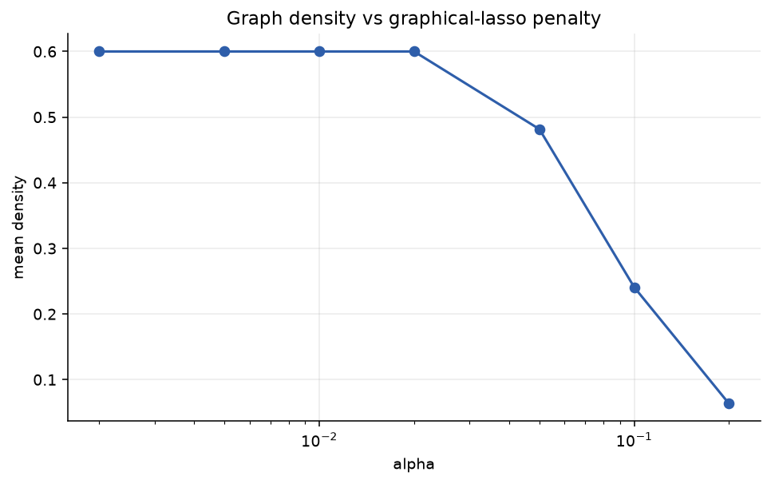

**Đọc gì:** với α = 0,002 / 0,005 / 0,01 / 0,02 — trải trên **10 lần** biên độ —
kết quả **giống hệt nhau đến từng con số**:

| α | Mật độ | Số cạnh | Trùng lặp top 5 |
|---:|---:|---:|---:|
| 0,002 | 0,600 | 261,0 | 1,00 |
| 0,005 | 0,600 | 261,0 | 1,00 |
| 0,010 | 0,600 | 261,0 | 1,00 |
| **0,020** | **0,600** | **261,0** | **1,00** |
| 0,050 | 0,482 | 209,5 | 0,40 |
| 0,100 | 0,241 | 104,8 | 0,40 |

261 = ⌊0,60 × 435⌋ chính xác. Đó là chữ ký của **trần mật độ**
(`max_graph_density = 0,60`), không phải của hệ số phạt.

Nghĩa là: **ở giá trị đang dùng α = 0,02, graphical lasso gần như không tạo ra độ
thưa nào.** Độ thưa của mạng công bố đến từ **bộ lọc phân vị cạnh** (giữ 25% mạnh
nhất). Câu chuyện "độc lập có điều kiện thưa" yếu hơn nhiều so với tên gọi của
phương pháp gợi ý.

Và khi hệ số phạt **thực sự** tác động (α ≥ 0,05), danh sách mã trung tâm đổi ngay —
trùng lặp top 5 rơi từ 1,0 xuống 0,4.

### 28c · Độ nhạy theo cửa sổ

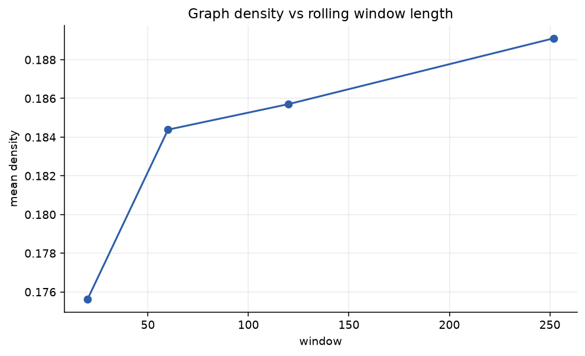

Mật độ chỉ đổi từ 0,176 lên 0,189 khi cửa sổ tăng **gấp 12 lần** (20 → 252 ngày).
Cũng như biểu đồ 07, điều này chủ yếu phản ánh **bộ lọc phân vị**, không phản ánh
dữ liệu. Đối chiếu biểu đồ 16b để thấy điều thực sự thay đổi theo cửa sổ: không
phải mật độ, mà là **thứ hạng các mã**.

### 18 · So sánh đa thang thời gian

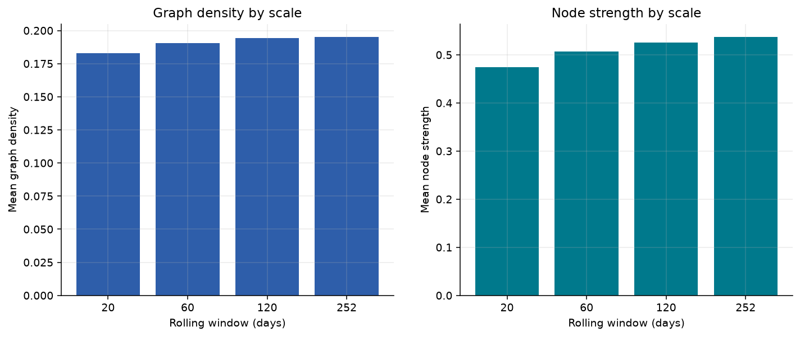

Mật độ 0,183 → 0,195 và độ mạnh 0,47 → 0,54 khi cửa sổ tăng từ 20 lên 252 ngày.
Cửa sổ dài cho liên hệ mạnh hơn một chút, đúng như kỳ vọng khi nhiễu ước lượng
giảm. Biên độ nhỏ; kết luận thực chất vẫn nằm ở biểu đồ 16b.

---

## Hạn chế

**Sai lệch sống sót.** Rổ là VN30 **hiện tại** giữ cố định từ 2012. Các mã đã rời
chỉ số không có mặt. Điều này ưu ái mọi kết quả ở đây như nhau, nhưng nó ưu ái tất
cả. Kết quả phân bổ vốn nên được đọc như so sánh **tương đối** giữa các quy tắc,
không phải như lợi suất tuyệt đối có thể đạt được.

**Số đỉnh thay đổi.** Rổ tăng từ ~15 lên 30 mã quanh 2018. Điều này chi phối biểu
đồ 10, có khả năng chi phối biểu đồ 08, và chưa được kiểm soát.

**Mô phỏng phân bổ bỏ qua:** tác động giá khi khớp lệnh (chi phí ở đây tuyến tính,
tác động thật thì lồi — các quy tắc vòng quay cao đang được đối xử quá nhẹ tay),
giới hạn sở hữu nước ngoài, quy mô lô, khả năng vay chứng khoán, và các lần thay
đổi thành phần rổ.

**Không phải chiến lược giao dịch.** Đây là các phép so sánh mô hình rủi ro.

**Không có phát biểu nhân quả nào.** Đồ thị là mô hình liên hệ thống kê. Thuật ngữ
trong mã nguồn phân biệt rõ `high_influence_node` (vô hướng) với
`directed_risk_transmitter` (chỉ dùng khi có tầng có hướng).

---

## Những lỗi đã tìm ra trong quá trình làm

Ghi lại vì chúng đều đã từng cho ra kết quả **trông có vẻ hợp lý**.

1. **Graphical lasso cho 0 cạnh.** Khớp trên ma trận hiệp phương sai (giá trị
   ~1e-4) với α = 0,02 xoá sạch mọi phần tử ngoài đường chéo. Sửa: khớp trên ma
   trận **tương quan**. Đã chốt bằng test.

2. **Bùng nổ đặc trưng:** 2.362 đặc trưng trên 3.600 quan sát. Sửa bằng danh sách
   trắng 23 chỉ số cốt lõi cộng bộ chọn đặc trưng khớp trong từng nếp gấp → 660.

3. **Thống kê t bị thổi phồng gấp 3.** Lợi suất 20 ngày tính hằng ngày chồng lấn 19
   ngày (tự tương quan 0,86). Dùng n thô cho t = 15,4; Newey–West cho t = 4,93.
   Đáng nói: vấn đề chồng lấn này đã được xử lý đúng cho tầng thị trường nhưng bị
   quên ở IC xếp hạng.

4. **`run_summary.json` ghi đường dẫn cơ sở dữ liệu ở dạng thô**, trong khi
   `ReproducibilityRecord` đã băm nó — làm việc băm ở nơi kia trở nên vô nghĩa.
   Phát hiện khi quét trước lúc đẩy lên GitHub. Sửa: băm đệ quy; `manifest.json`
   giờ ghi đường dẫn tương đối với kho mã.

5. **`.gitignore` không hoạt động.** Git **không hỗ trợ chú thích cuối dòng** —
   `artifacts/processed/   # ~50 MB` bị coi là tên thư mục chứa dấu `#`. Nếu không
   phát hiện, lần đẩy đầu tiên đã là **96,6 MB** thay vì 21,3 MB.

6. **Trộn lẫn artifact giữa các lần chạy** (xảy ra 3 lần). Phát hiện nhờ đối chiếu
   chéo `n_features`. Đã thêm `tests/test_artifact_consistency.py`.

7. **Số cược hiệu dụng không so sánh được giữa các bộ ước lượng** — mô tả ở biểu đồ
   34. **Chưa sửa**, đã ghi cảnh báo tại chỗ.

8. **Nhãn cụm không được ghép giữa các ngày** — mô tả ở biểu đồ 12. **Chưa sửa**.

---

## Cấu trúc kho mã

```
src/dynamicgraph/
  data/          dò tìm, nạp, chuẩn hoá, kiểm định dữ liệu (chỉ đọc)
  features/      lợi suất, khử ảnh hưởng thị trường, đặc trưng nút/thị trường, nhãn
  graphs/        shrinkage, graphical lasso, ảnh chụp, lọc cạnh, lead-lag, spillover
  network/       chỉ số đồ thị, chỉ số nút, cụm, phổ, chỉ số tập trung
  models/        baseline, chọn đặc trưng, hiệu chuẩn, GNN thời gian (tuỳ chọn)
  training/      chia purged walk-forward, huấn luyện, tinh chỉnh, xếp hạng nút
  evaluation/    phân loại, hiệu chuẩn, bootstrap khối, cắt bỏ, kiểm định đồ thị
  allocation/    hiệp phương sai, quy tắc trọng số, chẩn đoán, mô phỏng, đánh giá
  outputs/       biểu đồ, báo cáo markdown, JSON cho web
  api/           FastAPI chỉ đọc
dashboard/       bảng điều khiển HTML ngoại tuyến, tự chứa
tests/           239 test
artifacts/       biểu đồ, báo cáo, bảng số liệu (bộ nhớ đệm lớn bị loại khỏi kho)
```

## Báo cáo

| Tệp | Nội dung |
|---|---|
| [`allocation_report.md`](artifacts/reports/allocation_report.md) | Thí nghiệm phân bổ vốn và phán quyết |
| [`oos_evaluation.md`](artifacts/reports/oos_evaluation.md) | Đánh giá ngoài mẫu đầy đủ |
| [`graph_methodology.md`](artifacts/reports/graph_methodology.md) | Phương pháp dựng đồ thị |
| [`data_audit_report.md`](artifacts/reports/data_audit_report.md) | Kiểm toán dữ liệu nguồn |
| [`limitations.md`](artifacts/reports/limitations.md) | Hạn chế |
| [`assumptions.md`](artifacts/reports/assumptions.md) | Giả định đã ghi nhận |
| [`model_card.md`](artifacts/reports/model_card.md) | Thẻ mô hình |
| [`ablation_report.md`](artifacts/reports/ablation_report.md) | Nghiên cứu cắt bỏ |

## Giấy phép và dữ liệu

Mã nguồn dùng cho mục đích nghiên cứu. **Dữ liệu giá không được đưa vào kho** — cần
tự cấu hình nguồn của bạn trong `config/local.yaml` (đã nằm trong `.gitignore`).
Cơ sở dữ liệu nguồn chỉ được mở ở **chế độ chỉ đọc**; không có thao tác ghi nào
được thực hiện lên dữ liệu gốc.
