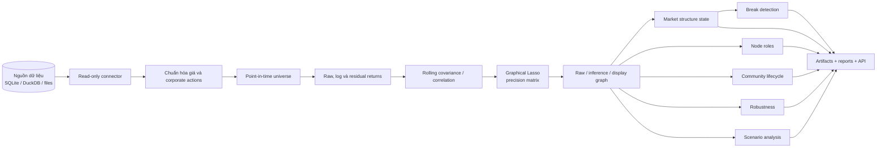
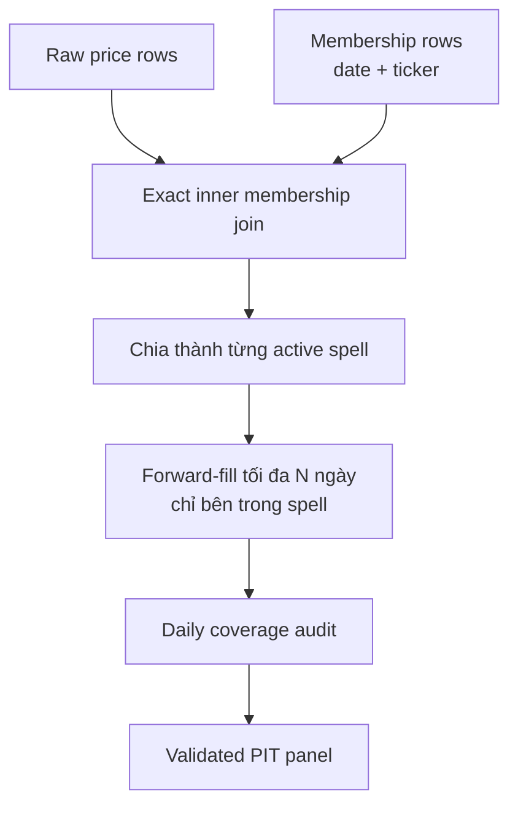
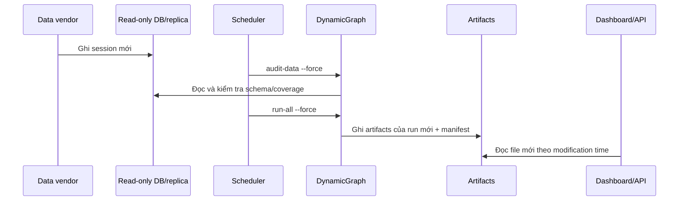
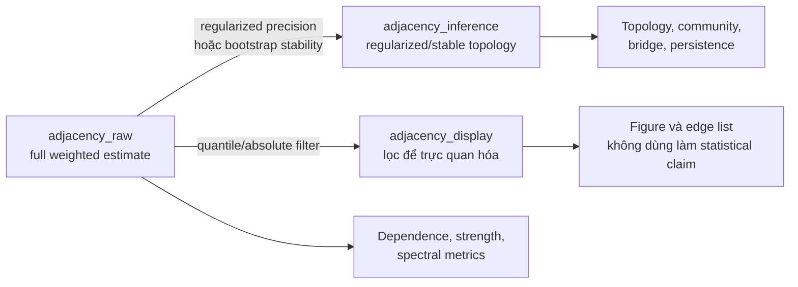
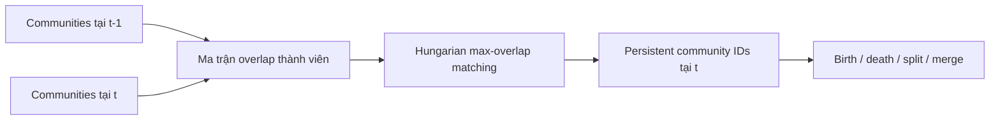
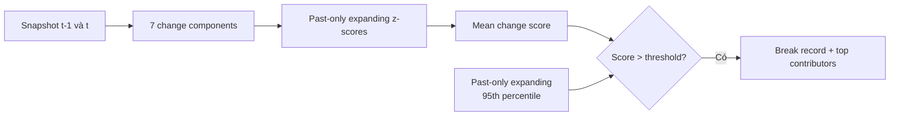
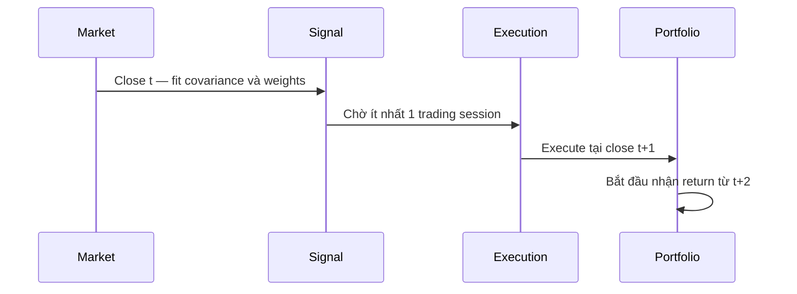
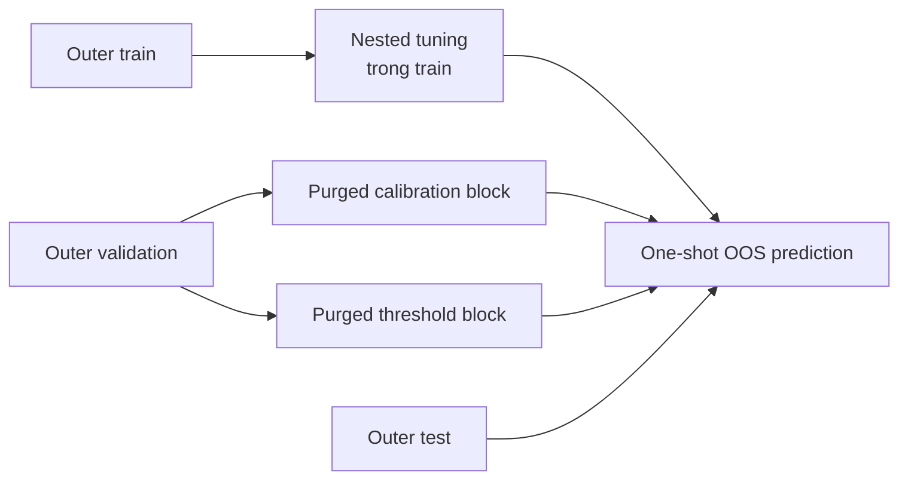

# DynamicGraph | Dynamic Market Structure Observatory

DynamicGraph là hệ thống quan sát cấu trúc thị trường động cho rổ cổ phiếu VN30. Mục tiêu chính là đo lường mạng phụ thuộc, vai trò node, cộng đồng, thay đổi chế độ và truyền dẫn shock theo thời gian. Đây không mặc định là mô hình dự báo giá hay hệ thống tạo tín hiệu giao dịch.

> **Trạng thái xác minh ngày 29/07/2026**
>
> - 297/297 tests pass, 0 warning; Ruff pass.
> - Các regression test bao phủ PIT universe, walk-forward, threshold theo fold, node ranking, allocation timing, spillover direction, lead–lag FDR, convergence, cache và artifact contract.
> - Pipeline synthetic chạy end-to-end. Pipeline database thực chưa được xác nhận vì workspace hiện chưa có panel đa mã hợp lệ.
> - `structure` là mode mặc định. Forecasting, allocation validation, scenario analysis là các workflow bật riêng; Temporal GNN tắt.
> - Các con số OOS cũ bị ảnh hưởng bởi lỗi correctness đã được đánh dấu trong `artifacts/invalidation_manifest.json`.

## 1. Research objective

Hệ thống trả lời bốn nhóm câu hỏi:

1. Cấu trúc phụ thuộc giữa các cổ phiếu đang tập trung hay phân tán?
2. Node nào đang là hub, bridge, community core, transmitter hoặc receiver?
3. Community nào sinh ra, biến mất, split, merge hoặc thay đổi thành viên?
4. Nếu áp một shock giả định lên node/sector/community, mạng hiện tại truyền shock như thế nào?

DynamicGraph không được dùng để khẳng định:

- centrality đồng nghĩa với quan hệ nhân quả hoặc “systemic importance” tuyệt đối;
- display graph là bằng chứng thống kê;
- scenario là xác suất một sự kiện sẽ xảy ra;
- annual return cao trong một backtest chứng minh graph tạo alpha.

## 2. What the system measures



Các output chính:

| Artifact | Ý nghĩa |
|---|---|
| `market_structure_state.parquet` | Một dòng trạng thái cấu trúc cho mỗi snapshot |
| `node_roles.parquet` | Vai trò, persistence và confidence của từng node |
| `community_state.parquet` | Persistent community ID và lifecycle events |
| `structural_breaks.csv` | Các break được phát hiện online và thành phần đóng góp |
| `graph_robustness.parquet` | Độ ổn định qua window, estimator và cấu hình |
| `scenario_report.parquet` | Kết quả truyền shock có điều kiện khi bật scenario mode |
| `run_manifest.json` | Data/config/code fingerprint, convergence và trạng thái artifact |

## 3. Point-in-time design và kết nối database

### Data contract

Nguồn tối thiểu phải có `date`, `ticker`, `close`. Nên có:

- `adjusted_close`;
- `open`, `high`, `low`;
- `volume`, `turnover`;
- `sector`;
- `market_cap` hoặc `shares_outstanding`;
- benchmark như `VN30`, hoặc cấu hình `index_source_symbol`.

Backend hiện được triển khai:

| Nguồn | Hỗ trợ | Chế độ |
|---|---:|---|
| DataPro SQLite | Có | `mode=ro` và write-denying authorizer |
| Generic SQLite | Có | Read-only |
| DuckDB | Có | `read_only=True` |
| Parquet/CSV/Feather | Có | Chỉ gọi read APIs |
| PostgreSQL/MySQL/MSSQL | Chưa | Cần bổ sung remote SQL connector |

`DYNAMICGRAPH_DATABASE_URL` hiện chỉ hữu ích cho SQLite/DuckDB URI hoặc đường dẫn được backend hiện tại hiểu; chưa phải generic SQLAlchemy remote URL.

### PIT universe

Membership được join theo đúng khóa `(date, ticker)`. `effective_from` và `effective_to` đều inclusive. Benchmark được căn lịch riêng và không được tính là constituent.



Forward-fill không được đi qua ngày gia nhập, rời hoặc tái gia nhập. Mỗi ngày lưu:

- `n_universe`;
- `n_observed`;
- `coverage_ratio`;
- `active_tickers`;
- `observed_tickers`.

Nếu file universe không có effective dates, hệ thống gắn cảnh báo survivorship bias. Có thể dùng `liquidity_proxy`, được xếp hạng lại từ trailing turnover và market-cap proxy chỉ bằng dữ liệu có sẵn tại ngày rebalance.

### Cập nhật từ database

Pipeline hiện là batch refresh, chưa phải streaming:



Với SQLite, fingerprint bao gồm toàn bộ file và WAL; thay đổi lịch sử hoặc append dữ liệu làm đổi cache key. Với thư mục CSV, nên dùng `--force` vì directory content hiện chưa tự tham gia cache fingerprint. Chưa có scheduler tích hợp; có thể dùng Windows Task Scheduler, cron hoặc orchestration bên ngoài.

Để tránh một run đọc nhiều trạng thái database khác nhau, production nên đọc từ snapshot/replica ổn định sau khi phiên ingest hoàn tất.

## 4. Graph representations

### Return và residualization

Log return:

```text
r(i,t) = log(P(i,t) / P(i,t-1))
```

Core graph mặc định dùng residual return:

```text
r(i,t) = alpha(i,t) + beta(i,t) * r(m,t) + epsilon(i,t)
```

`alpha` và `beta` được fit bằng rolling moments trên cửa sổ kết thúc tại `t`; không dùng tương lai. Khi bật sector residualization, sector factor là leave-one-out nên một cổ phiếu không xuất hiện trong chính factor dùng để giải thích nó. Singleton sector trả `NaN`.

### Graphical Lasso và partial correlation

Graphical Lasso được fit trên correlation matrix để penalty có scale ổn định:

```text
Theta* = argmin[ tr(S Theta) - log det(Theta) + alpha * ||Theta||₁,off ]
```

Partial correlation:

```text
rho_partial(i,j) = -Theta(i,j) / sqrt(Theta(i,i) * Theta(j,j))
```

Nó đo dependence giữa `i` và `j` sau khi condition trên các node còn lại.

### Ba representation bắt buộc



| Representation | Consumer hợp lệ |
|---|---|
| `adjacency_raw` | Weighted dependence, spectral metrics, concentration |
| `adjacency_inference` | Degree/topology, community, bridge, persistence |
| `adjacency_display` | Network figure và edge list cho người đọc |

Density của quantile-filtered display graph phần lớn do cấu hình quyết định, nên không được diễn giải là market-state metric.

## 5. Structural metrics

Mỗi snapshot ghi rõ estimator, window, residualization, universe coverage, convergence và representation.

Các metric chính:

- Mean, median và upper-tail absolute raw dependence.
- Leading spectral share và spectral entropy của raw adjacency.
- Normalized strength concentration:

```text
HHI_normalized = (sum(pᵢ²) - 1/N) / (1 - 1/N)
```

- Community count, entropy, concentration và modularity.
- Inference density, edge stability và edge turnover.
- Raw-adjacency distance và spectral distance giữa hai snapshot liên tiếp.
- Community similarity bằng normalized mutual information.
- Cross-method rank agreement.

`market_mode_share` trong artifact hiện là leading spectral share của **raw adjacency**, không phải phần phương sai của covariance PCA. Tên trường được giữ để tương thích nhưng report phải nêu rõ representation.

Khoảng uncertainty đơn giản quanh mean raw dependence là normal-approximation diagnostic; bootstrap stability và cross-configuration agreement mới là kiểm tra robustness chính.

## 6. Node roles

Role được gán theo cross-sectional percentile tại mỗi snapshot, theo thứ tự ưu tiên:

| Role | Quy tắc |
|---|---|
| `unstable` | Mean edge stability của node `< 0.5` |
| `transmitter` | Directed out-strength thuộc top 20% |
| `receiver` | Directed in-strength thuộc top 20% |
| `hub` | Strength và eigenvector centrality cùng thuộc top 20% |
| `bridge` | Bridge score thuộc top 20% |
| `community_core` | Within-community strength thuộc top 20% |
| `peripheral` | Không thỏa các điều kiện trên |

Bridge score là trung bình percentile rank của participation coefficient và betweenness. Role confidence kết hợp:

- role persistence rolling 20 snapshots;
- edge stability;
- agreement qua window/method.

`transmitter` và `receiver` chỉ có ý nghĩa khi directed graph tồn tại. Vai trò là nhãn cấu trúc có điều kiện, không phải khuyến nghị mua/bán.

## 7. Community dynamics

Community label thô không ổn định theo thời gian. DynamicGraph dùng maximum-overlap Hungarian assignment để map label mới sang persistent ID:



Mỗi community ghi:

- member list và size;
- birth/death;
- split/merge;
- Jaccard-style member turnover;
- sector purity;
- persistence snapshots;
- aggregate risk và centrality;
- modularity.

Không so sánh trực tiếp numeric label chưa alignment giữa hai snapshot.

## 8. Structural breaks

Break score kết hợp:

- raw adjacency distance;
- spectral distance;
- edge turnover;
- `1 - community_similarity`;
- thay đổi market-mode share;
- thay đổi strength concentration;
- thay đổi community concentration.

Mỗi component được chuẩn hóa bằng mean và standard deviation của **lịch sử trước ngày hiện tại**. Negative z-score được clip về 0. `change_score` là trung bình các component score.



Threshold dùng expanding 95th percentile đã `shift(1)`, vì vậy ngày tương lai không tham gia đặt ngưỡng. `break_severity = change_score / threshold`.

## 9. Scenario analysis

Directed adjacency tuân theo convention:

```text
adjacency[source, target] = mức truyền từ source sang target
```

Lead–lag áp dụng Benjamini–Hochberg FDR trên toàn bộ family `pair × lag` trước khi chọn lag mạnh nhất. Spillover/FEVD được chuyển đúng sang source→target adjacency.

Scenario chuẩn hóa mỗi hàng adjacency thành transition matrix `T` và truyền shock:

```text
s(0)   = imposed shock
s(k+1) = damping * s(k) * T
```

Output gồm direct impact, second-order impact, cumulative impact, affected nodes, receiver concentration, horizon, estimator và uncertainty. Hỗ trợ:

- một hoặc nhiều shocked node;
- sector shock;
- community shock;
- remove node/edge;
- tăng volatility cho một nhóm.

Đây là conditional network propagation: “nếu shock được áp thì mạng hiện tại truyền ra sao”, không phải forecast rằng shock sẽ xảy ra.

## 10. Robustness and uncertainty

Robustness report phân tách:

- estimator;
- window;
- alpha;
- residualization;
- universe;
- filtering rule;
- bootstrap sample;
- data coverage.

Nó đo:

- mean edge stability và stability quantiles;
- convergence rate từng configuration;
- Spearman rank agreement của node strength qua phương pháp;
- community NMI qua phương pháp;
- node-role stability proxy.

Graphical Lasso capture `ConvergenceWarning`, iterations, dual gap/cost, retry count và fallback reason. Nếu bất kỳ snapshot được đưa vào publication có `glasso_converged=False`, publication contract từ chối xuất bản run đó.

`run_manifest.json` khóa:

- git commit và working-tree code fingerprint;
- data fingerprint;
- effective config hash;
- universe definition và date range;
- feature schema;
- fitted graph parameters;
- convergence diagnostics;
- test status;
- artifact status và historical invalidation IDs.

## 11. Allocation validation

Allocation là kiểm định second-moment/risk model, không phải bằng chứng graph dự báo return.

Các estimator:

- sample covariance;
- Ledoit–Wolf;
- EWMA;
- graphical-lasso covariance;
- diagonal covariance.

Các rule:

- equal weight;
- inverse volatility;
- risk parity;
- minimum variance;
- hierarchical community risk parity.

Community risk parity tạo risk-parity sleeve trong từng community, sau đó cân bằng risk giữa các sleeve. Mọi rule đi qua cùng long-only capped-simplex projection; cấu hình không khả thi bị từ chối thay vì âm thầm nới constraint.



Missing return của vị thế đang giữ đóng góp 0 và không làm renormalize các tài sản còn lại. Transaction cost dựa trên traded weight turnover.

Primary metrics:

- realized volatility;
- covariance Frobenius error và QLIKE;
- realized variance forecast error;
- maximum drawdown;
- turnover và transaction cost;
- weight concentration;
- effective positions/bets;
- stability.

## 12. Forecasting experiment và kết quả âm

Forecasting chỉ chạy trong `forecast_experimental`.



Các nguyên tắc:

- OOS test blocks liên tục và không overlap.
- Purge nằm giữa train/validation/test, không tạo gap giữa các test blocks.
- Target quantile, schema, coverage, variance, redundancy và selector đều fit trong fold.
- Calibration và decision-threshold blocks tách nhau theo thời gian.
- Hard metrics và event metrics dùng threshold của từng observation/fold.
- Node ranking dự đoán rank nhưng portfolio P&L dùng raw future simple returns.
- Paired bootstrap bảo toàn fold groups; multiple comparisons dùng Holm correction.
- Feature importance không được tạo bằng cách refit trên concatenated OOS labels. Chỉ được xuất bản khi training stage lưu held-out importance theo fold.

Lần chạy lịch sử trước audit không cho thấy incremental predictive value bền vững, nhưng các con số cụ thể đã bị invalidated. Kết luận hợp lệ hiện tại là:

> Chưa có bằng chứng OOS đã được tái xác nhận để tuyên bố graph tạo predictive alpha.

Không được chuyển câu này thành khẳng định rằng graph chắc chắn không có predictive value; cần chạy lại trên panel PIT hợp lệ.

## 13. Báo cáo nhận xét hiện trạng và giới hạn

### Nhận xét kỹ thuật

| Hạng mục | Trạng thái | Nhận xét |
|---|---|---|
| Correctness/unit/integration | Tốt | 297/297 tests pass, 0 warning |
| PIT logic | Tốt ở mức code | Cần official effective-dated membership để xác nhận dữ liệu thực |
| Graph convergence handling | Tốt | Warning/fallback được ghi và failed snapshot bị chặn publish |
| Structure observatory | Sẵn sàng thử nghiệm DB | Synthetic integration đã pass |
| Database integration | Sẵn sàng có điều kiện | SQLite/DuckDB/file; chưa hỗ trợ remote SQL |
| Automated refresh | Một phần | Batch command có sẵn; chưa có built-in scheduler/streaming |
| Predictive forecasting | Chưa được xác nhận | Không có claim alpha hiện hành |
| Allocation | Validation-only | Không diễn giải annual return thành alpha |

### Cách đọc trạng thái cấu trúc

| Quan sát | Diễn giải thận trọng |
|---|---|
| Raw dependence tăng | Các node đồng biến/đối biến mạnh hơn sau conditioning đã chọn |
| Strength concentration tăng | Dependence tập trung vào ít node hơn |
| Spectral entropy giảm | Cấu trúc bị chi phối bởi ít mode hơn |
| Edge turnover tăng | Topology inference thay đổi nhanh |
| Community similarity giảm | Partition thay đổi đáng kể |
| Cross-method agreement thấp | Kết luận nhạy với estimator/window |
| Coverage giảm | Metric có thể thay đổi do universe/data availability |
| Break flag bật | Cấu trúc khác lịch sử trước đó; không tự động là crash signal |

### Giới hạn còn lại

- Workspace chưa có database đa mã để benchmark runtime và memory thực tế.
- Static VN30 file không có effective dates vẫn survivorship-biased.
- Corporate-action quality, sector mapping, foreign ownership, liquidity và market impact phụ thuộc nguồn.
- Remote PostgreSQL/MySQL/MSSQL connector và transaction snapshot chưa được triển khai.
- Directory-based file cache cần `--force` khi dữ liệu thay đổi.
- Lead–lag và FEVD là quan hệ thống kê, không chứng minh causal transmission.
- Scenario là linear conditional propagation trên graph hiện tại.
- Role thresholds là relative top-quintile nên role có thể đổi khi composition universe đổi.

## 14. Reproduction và vận hành

### Cài đặt

```powershell
python -m venv .venv
.\.venv\Scripts\python.exe -m pip install -e ".[dev,db]"
Copy-Item config/local.example.yaml config/local.yaml
```

Ví dụ `config/local.yaml`:

```yaml
extends: default.yaml

project:
  mode: structure

data:
  database_path: "D:/data/market.sqlite"
  backend: sqlite
  table: daily_prices
  index_source_symbol: VN30INDEX
  universe_method: static_list
  universe_file: "config/vn30_membership.csv"
  column_map:
    date: trading_date
    ticker: symbol
    close: close_price
    adjusted_close: adjusted_price
    volume: matched_volume

output:
  artifacts_dir: artifacts
```

Universe PIT mẫu:

```csv
ticker,effective_from,effective_to
AAA,2020-01-01,2021-06-30
BBB,2020-01-01,
CCC,2021-07-01,
```

### Kiểm tra nguồn và chạy pipeline

```powershell
.\.venv\Scripts\python.exe -m dynamicgraph.cli discover-data `
  --root "D:\data"

.\.venv\Scripts\python.exe -m dynamicgraph.cli audit-data `
  -c config/local.yaml --force

.\.venv\Scripts\python.exe -m dynamicgraph.cli run-all `
  -c config/local.yaml --force
```

Chạy test:

```powershell
.\.venv\Scripts\python.exe -m pytest -o addopts= -q
.\.venv\Scripts\ruff.exe check .
```

Phục vụ artifacts qua read-only API:

```powershell
.\.venv\Scripts\python.exe -m pip install -e ".[api]"
.\.venv\Scripts\uvicorn.exe dynamicgraph.api.app:app `
  --host 127.0.0.1 --port 8000
```

Các mode:

| Mode | Module được bật |
|---|---|
| `structure` | Structure observatory; mặc định |
| `forecast_experimental` | Structure + stress forecasting + node ranking |
| `allocation_validation` | Structure + allocation validation |
| `scenario_analysis` | Structure + directed scenario analysis |

Không dùng artifact cũ để kết luận nếu manifest không khớp data fingerprint, config hash, git/code fingerprint, convergence status hoặc còn invalidation flag.
