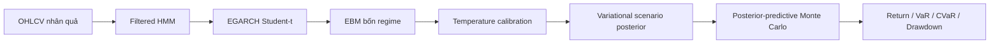
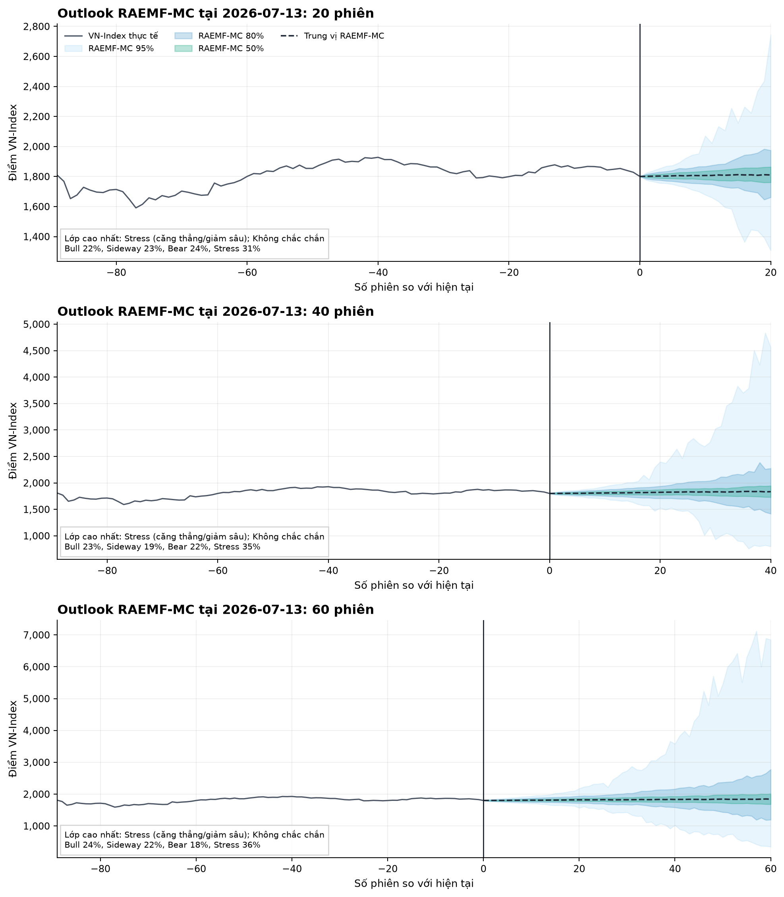
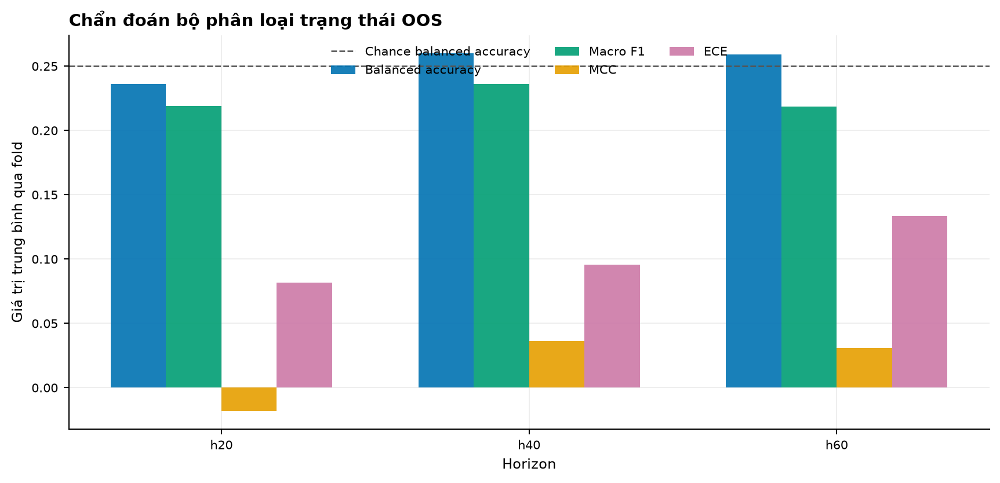
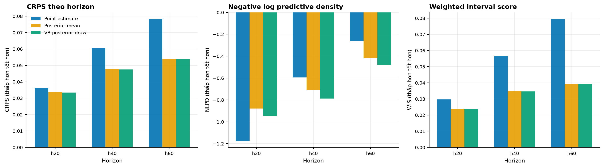
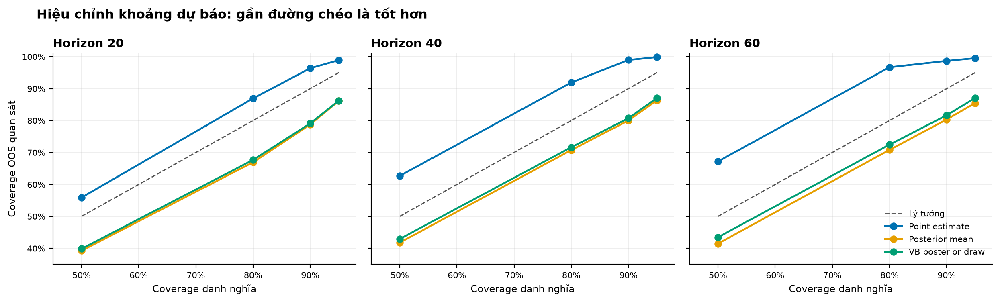
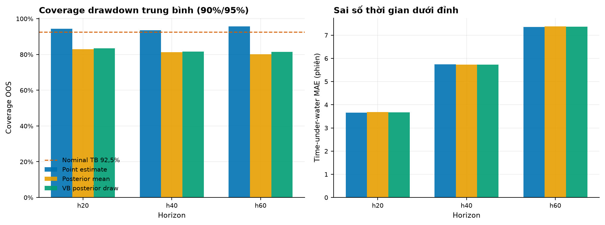
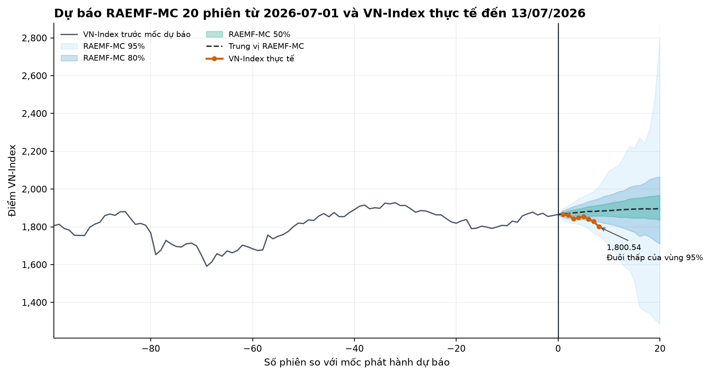
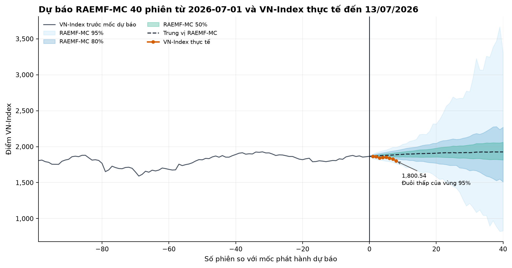
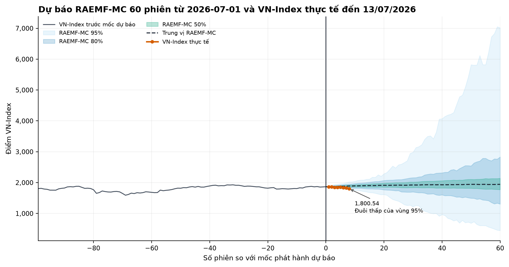

# RAEMF-VB-MC

[](https://www.python.org/)
[](LICENSE)

Regime-Aware Explainable Multi-Horizon Forecasting with Variational Bayes and
Monte Carlo cho VN-Index.

> **Báo cáo chính:** [TRAIN / VALID / TEST, xác suất bốn regime và quản trị rủi ro](RAEMF_VB_MC_REPORT.md)

Artifact hiện tại dùng dữ liệu đến **13/07/2026**. Live forecast chưa đủ
20/40/60 phiên để chấm kết quả. Đây là mô hình nghiên cứu, không phải khuyến
nghị đầu tư.

## Mô hình xuất ra gì?

RAEMF-VB-MC có hai nhóm đầu ra:

1. Xác suất bốn regime từ EBM:
   `P(Bull)`, `P(Sideway)`, `P(Bear)`, `P(Stress)`.
2. Phân phối posterior-predictive từ Variational Bayes + Monte Carlo:
   quantile lợi suất, xác suất âm, VaR, CVaR và xác suất drawdown.



Variational Bayes chỉ Bayesian hóa scenario return layer. Filtered HMM,
EGARCH recursion, EBM và calibration vẫn là point-estimate. Monte Carlo không
bị thay thế: mỗi path lấy một parameter draw từ posterior và giữ draw đó cố
định trong toàn horizon.

## Dữ liệu và TRAIN / VALID / TEST

Benchmark VB dùng 6.306 phiên VN-Index từ 28/07/2000 đến 13/07/2026, ba
expanding outer fold cho mỗi horizon và purge bắt buộc:
`target_end_date_h < boundary`.

| h | TRAIN mỗi fold | VALID mỗi fold | TEST mỗi fold | Tổng TEST |
| ---: | ---: | ---: | ---: | ---: |
| 20 | 3.752–5.009 | 608 | 628–629 | 1.886 |
| 40 | 3.720–4.973 | 586 | 626–627 | 1.880 |
| 60 | 3.688–4.937 | 564 | 624–625 | 1.874 |

- **TRAIN:** fit feature selector, HMM, EGARCH, EBM và variational posterior.
  Cả 9/9 posterior fold-fit hội tụ. Không dùng metric in-sample làm headline.
- **VALID:** chọn/calibrate; không dùng làm final evidence.
- **TEST:** chỉ chấm sau khi model, prior và calibration đã khóa.

Chi tiết từng fold:
[fold_metadata.csv](outputs/distribution_oos_vb/fold_metadata.csv).

## Xác suất bốn regime hiện tại

Deployment refit dùng dữ liệu đến 13/07/2026:

| h | Bull | Sideway | Bear | Stress | Bear + Stress | Argmax | Confidence |
| ---: | ---: | ---: | ---: | ---: | ---: | --- | --- |
| 20 | 21,96% | 22,65% | 23,90% | 31,49% | 55,39% | Stress | Uncertain |
| 40 | 23,27% | 19,08% | 22,49% | 35,16% | 57,65% | Stress | Uncertain |
| 60 | 23,66% | 22,28% | 18,22% | 35,85% | 54,06% | Stress | Uncertain |

Nguồn máy đọc được:
[current_predictions.csv](outputs/current_monitor/current_predictions.csv).



Stress có xác suất lớn nhất nhưng chưa đạt xác suất đa số. Cả ba horizon đều
`Uncertain`; không nên đọc argmax như một dự báo chắc chắn.

## Kết quả TEST của classifier

Trung bình ba outer TEST fold:

| h | Macro F1 | Balanced acc. | Brier | Log loss | ECE | Recall Bear | Recall Stress |
| ---: | ---: | ---: | ---: | ---: | ---: | ---: | ---: |
| 20 | 0,2192 | 0,2360 | 0,7432 | 1,3690 | 0,0817 | 0,0667 | 0,2930 |
| 40 | 0,2360 | 0,2601 | 0,7382 | 1,3575 | 0,0955 | 0,0840 | 0,2633 |
| 60 | 0,2183 | 0,2593 | 0,7387 | 1,3578 | 0,1335 | 0,0741 | 0,3533 |

Nhận diện Bear vẫn yếu. Bayesian regime head không thay EBM vì proper score
tốt hơn nhưng recall Bear/Stress giảm. Xem
[classification_metrics.csv](outputs/distribution_oos_vb/classification_metrics.csv)
và [quyết định classifier](outputs/latest/vb_decisions.json).



File có từng ngày TEST, nhãn thực tế và đủ bốn xác suất:
[predictions_test.csv](outputs/latest/predictions_test.csv). Cần lọc
`model == "RAEMF-MC"` vì file cũng chứa model đối chứng.

## Kết quả TEST của phân phối VB

M2 là `variational_posterior`; bảng dưới dùng trung bình ba Monte Carlo seed:

| h | CRPS | WIS | Coverage 90% | Coverage 95% | VaR95 violation |
| ---: | ---: | ---: | ---: | ---: | ---: |
| 20 | 0,0335 | 0,0239 | 79,11% | 86,23% | 11,44% |
| 40 | 0,0476 | 0,0347 | 80,73% | 87,07% | 12,29% |
| 60 | 0,0537 | 0,0390 | 81,66% | 87,07% | 11,29% |

M2 cải thiện CRPS/WIS so với point estimate với paired moving-block
bootstrap CI loại 0, nhưng khoảng dự báo quá hẹp: coverage thấp hơn danh nghĩa
và VaR95 violation cao hơn mức 5% kỳ vọng.





Theo quy tắc đăng ký trước, production default vẫn là `point_estimate`.
`variational_posterior` tiếp tục được xuất như research output.

## Thông số quản trị rủi ro hiện tại

Variational posterior live, 1.500 Monte Carlo path, forecast origin 13/07/2026:

| h | Median return | Dải 95% | P(return < 0) | P(DD >10%) | VaR95 | CVaR95 |
| ---: | ---: | --- | ---: | ---: | ---: | ---: |
| 20 | +0,99% | -4,53% đến +6,59% | 32,60% | 0,27% | 3,17% | 4,97% |
| 40 | +2,25% | -5,98% đến +10,24% | 25,40% | 1,60% | 4,53% | 6,85% |
| 60 | +3,32% | -5,15% đến +12,79% | 19,40% | 2,33% | 3,44% | 6,75% |

Nguồn:
[latest_forecast_vb.json](outputs/latest/latest_forecast_vb.json) và
[latest_drawdown_risk_vb.csv](outputs/latest/latest_drawdown_risk_vb.csv).

Các số live chưa đáo hạn. Trên TEST, M2 đánh giá thấp tần suất drawdown >10%
và VaR violation cao; vì vậy không dùng VaR/CVaR M2 làm production risk limit
trước khi volatility layer được hiệu chỉnh lại.



## Trạng thái production

| Thành phần | Production default | Research |
| --- | --- | --- |
| Classifier bốn regime | EBM | Bayesian regime head |
| Scenario mode | `point_estimate` | `posterior_mean_mc`, `variational_posterior` |
| Risk limit | Chưa tự động hóa | VaR/CVaR/drawdown artifacts |

<!-- RESULTS_START -->

## Evaluation classifier single-split

Bảng này được tạo từ point-estimate run dùng dữ liệu đến 01/07/2026. Các
metric chính phía trên từ benchmark ba outer fold được ưu tiên khi kết luận.

| horizon | n_obs | macro_f1 | balanced_accuracy | mcc | brier | log_loss | ece | recall_bull | recall_sideway | recall_bear | recall_stress |
| --- | --- | --- | --- | --- | --- | --- | --- | --- | --- | --- | --- |
| 20 | 1256 | 0.3057 | 0.3118 | 0.1093 | 0.7287 | 1.3451 | 0.0894 | 0.3390 | 0.6075 | 0.0667 | 0.2338 |
| 40 | 1252 | 0.3006 | 0.3058 | 0.1237 | 0.7261 | 1.3388 | 0.0950 | 0.3907 | 0.6226 | 0.0632 | 0.1467 |
| 60 | 1248 | 0.2797 | 0.2815 | 0.0557 | 0.7303 | 1.3417 | 0.0681 | 0.3283 | 0.5655 | 0.0286 | 0.2035 |

<!-- RESULTS_END -->

## Cài đặt và chạy lại

```bash
python -m pip install -e ".[dev,bayesian-core]"

# Point-estimate classifier
bash scripts/run_laptop.sh

# Full RAEMF-VB-MC
bash scripts/run_laptop_vb.sh

# Kiểm thử
conda run -n project python -m pytest -q
python -m ruff check src tests scripts
```

`scripts/run_laptop_vb.sh` thực hiện data merge, hardware report, benchmark
OOS M0/M1/M2, benchmark regime head và live forecast. Backend chính là
PyTorch; PyMC/NUTS chỉ dùng làm validation tham chiếu trên bài toán nhỏ.

## Artifact cần đọc

| Nội dung | File |
| --- | --- |
| Báo cáo đầy đủ | [RAEMF_VB_MC_REPORT.md](RAEMF_VB_MC_REPORT.md) |
| Báo cáo VB OOS gốc | [report.md](outputs/distribution_oos_vb/report.md) |
| TRAIN/VALID/TEST | [fold_metadata.csv](outputs/distribution_oos_vb/fold_metadata.csv) |
| Metric classifier TEST | [classification_metrics.csv](outputs/distribution_oos_vb/classification_metrics.csv) |
| Metric distribution TEST | [distribution_metrics_summary.csv](outputs/distribution_oos_vb/distribution_metrics_summary.csv) |
| Xác suất bốn regime live | [current_predictions.csv](outputs/current_monitor/current_predictions.csv) |
| Xác suất bốn regime TEST | [predictions_test.csv](outputs/latest/predictions_test.csv) |
| Risk live VB | [latest_drawdown_risk_vb.csv](outputs/latest/latest_drawdown_risk_vb.csv) |
| Quyết định production | [vb_decisions.json](outputs/latest/vb_decisions.json) |

## Giới hạn

- Chỉ dùng OHLCV VN-Index; chưa có vĩ mô, breadth, tin tức hoặc thay đổi thành
  phần chỉ số.
- Recall Bear thấp trên OOS.
- Variational posterior hiện under-cover và đánh giá thấp drawdown frequency.
- Live forecast chưa đáo hạn nên chưa thể chấm đúng/sai.
- Backtest không phản ánh tracking error, thuế, spread biến thiên hoặc khả
  năng giao dịch trực tiếp VN-Index.
- Đây là nghiên cứu mô hình và quản trị rủi ro, không phải khuyến nghị đầu tư.

## Tài liệu kỹ thuật

- [Phương pháp Variational Bayes](docs/variational_bayes_methodology.md)
- [Audit kiến trúc](docs/variational_bayes_upgrade_audit.md)
- [ADVI/NUTS validation](docs/bayesian_validation.md)
- [Theo dõi forecast hiện tại](docs/current_monitoring.md)
- [Giải thích cho người không chuyên](outputs/current_monitor/report_for_nonspecialists.md)

MIT License.

<!-- CURRENT_MONITOR_START -->

## Theo dõi dự báo RAEMF-MC đến dữ liệu hiện tại

Dự báo gốc được phát hành sau phiên **2026-07-01** tại VN-Index **1,865.37**. File mới có dữ liệu đến **2026-08-06**, tương đương **26 phiên mới**; VN-Index hiện ở **1,764.78**, thay đổi **-5.39%** so với mức neo dự báo.

> **Trạng thái đánh giá:** horizon ngắn nhất là 20 phiên nên hiện chưa có horizon nào đủ ngày để kết luận dự báo lớp đúng hay sai. Các số dưới đây là theo dõi giữa kỳ, không phải điểm accuracy mới. Dữ liệu mới sửa mức đóng cửa 01/07 thêm +0.10% so với file dùng khi phát hành dự báo. Đánh giá vẫn neo tại mức cũ để không sửa dự báo sau khi đã biết dữ liệu mới.

### Dự báo ngày 01/07 đang diễn biến thế nào?

| Horizon | Đã quan sát | Còn lại | Dự báo 01/07 | Trạng thái chấm | Lợi suất tạm thời | Vị trí trong dải |
| --- | ---: | ---: | --- | --- | ---: | --- |
| 20 phiên | 20 | 0 | Sideway (đi ngang) | Đã đủ phiên để chấm cuối kỳ | -8.61% | Đuôi thấp của vùng 95% |
| 40 phiên | 26 | 14 | Sideway (đi ngang) | Đang theo dõi, chưa đủ phiên | -5.39% | Trong vùng 80% |
| 60 phiên | 26 | 34 | Sideway (đi ngang) | Đang theo dõi, chưa đủ phiên | -5.39% | Trong vùng 80% |







Ba hình chỉ trả lời một câu hỏi giữa kỳ: đường VN-Index thực tế đang nằm ở đâu trong phân phối kịch bản RAEMF-MC đã tạo trước đó. Nằm trong dải không đồng nghĩa dự báo hướng đã đúng; kết luận lớp chỉ có thể chấm khi đủ 20, 40 hoặc 60 phiên.

### RAEMF-MC báo cáo gì tại 2026-08-06?

**Xác suất trạng thái**

| Horizon | Bull | Sideway | Bear | Stress | Lớp xác suất cao nhất | Độ tin cậy |
| --- | ---: | ---: | ---: | ---: | --- | --- |
| 20 phiên | 22.7% | 29.5% | 24.6% | 23.2% | Sideway (đi ngang) | Không chắc chắn |
| 40 phiên | 20.3% | 35.7% | 25.3% | 18.8% | Sideway (đi ngang) | Không chắc chắn |
| 60 phiên | 19.4% | 36.8% | 23.0% | 20.8% | Sideway (đi ngang) | Không chắc chắn |

**Phân phối mức điểm và rủi ro**

| Horizon | Trung vị cuối kỳ | Dải 90% cuối kỳ | P(lợi suất dương) | P(drawdown >10%) | VaR 95% |
| --- | ---: | --- | ---: | ---: | ---: |
| 20 phiên | 1,753 | 1,553 - 1,971 | 44.5% | 15.4% | 12.8% |
| 40 phiên | 1,769 | 1,459 - 2,148 | 51.3% | 28.5% | 19.0% |
| 60 phiên | 1,771 | 1,199 - 2,571 | 51.8% | 41.7% | 38.7% |

Tại cả ba horizon, `Sideway` là lớp có xác suất cao nhất nhưng chỉ ở mức 29.5%-36.8%, chưa phải xác suất đa số, và độ tin cậy đều là `Uncertain`. Trong khi đó trung vị Monte Carlo tương ứng là -0.7%, +0.2% và +0.4%. Bộ phân loại trạng thái và bộ mô phỏng đường giá là hai thành phần khác nhau; mọi sự lệch giữa hai đầu ra phải được đọc là dấu hiệu bất định, không phải dự báo chắc chắn theo một hướng.


RAEMF-MC không dự đoán một điểm VN-Index chính xác. Mô hình báo cáo xác suất của bốn trạng thái tăng, đi ngang, giảm và căng thẳng; dải mức chỉ số có điều kiện; xác suất lợi suất dương/âm; cùng rủi ro đuôi và drawdown theo từng horizon.

### Cách đọc cho người không chuyên

- `Bull`, `Sideway`, `Bear`, `Stress` là bốn kịch bản thị trường, không phải lệnh mua hoặc bán.
- Cột xác suất cho biết mô hình đang phân bổ niềm tin như thế nào; các xác suất gần nhau nghĩa là mô hình chưa chắc chắn.
- Dải 50%, 80% và 95% càng rộng thì bất định càng lớn. Đây là kịch bản mô phỏng, không phải cam kết VN-Index sẽ nằm trong dải.
- Chỉ chấm đúng/sai cho horizon khi đủ số phiên tương ứng. Theo dõi vài phiên đầu chỉ cho biết quỹ đạo đang ở đâu, chưa đo được năng lực dự báo cuối kỳ.

### Hạn chế

- Mô hình chỉ dùng lịch sử OHLCV VN-Index; chưa có lãi suất, tỷ giá, vĩ mô, market breadth, tin tức hay thay đổi thành phần chỉ số.
- Deployment refit dùng tham số đã khóa từ nghiên cứu trước, nhưng HMM, EGARCH và EBM vẫn có thể bị regime drift khi thị trường đổi cấu trúc.
- Monte Carlo phụ thuộc giả định HMM, EGARCH Student-t và cách tái trọng số bằng xác suất EBM; đuôi phân phối có thể rất rộng.
- VN-Index không phải tài sản có thể giao dịch trực tiếp theo giả định đơn giản; phần này không phải backtest chiến lược và không phải lời khuyên đầu tư.

Báo cáo đầy đủ cho người không chuyên: [current monitor report](outputs/current_monitor/report_for_nonspecialists.md).

<!-- CURRENT_MONITOR_END -->
